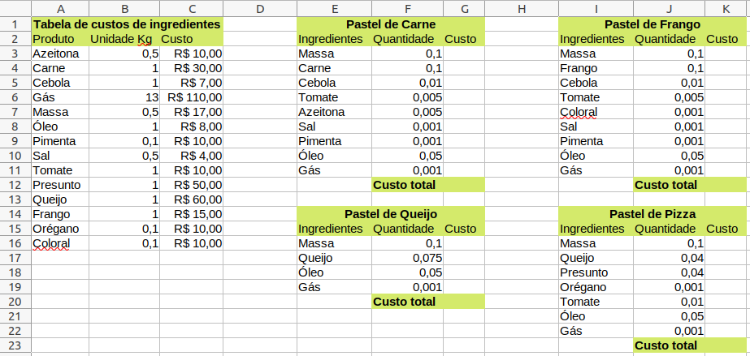

# Aula - Custos

## Situação de aprendizagem desafiadora
### Contextualização
Sr. Suji Nakamura, descendente de japoneses, abriu uma barraca de pasteis e precisa calcular os custos para a produção de cada sabor de pastel. iicialmente está produzindo apenas pasteis de carne, queijo, frango e pizza, e os vende por um preço fixo de dez reais.

### Desafio

- 1 Abra o excel e em uma nova planilha digite os dados da imagem acima.
- 2 Formate os dados no formato de moeda conforme indicado na imagem.
- 3 Calcule o custo de cada ingrediente dos quatro sabores de pasteis, utilize a função **PROCV()** para buscar o **custo** do ingrediente e **multiplique** pela **quantidade**
- 4 Calcue o custo total de cada sabor de pastel.
- 5 Sabendo que o Sr. Suji Nakamura vende em média 50 pasteis por dia a 10 reais cada um, calcule qual o lucro ele teria se vendesse:

|Pastel|Quantidade|Custo|Preço|Lucro|
|-|:-:|-|-:|-|
|Carne|20||R$ 10,00||
|Queijo|5||R$ 10,00||
|Frango|15||R$ 10,00||
|Pizza|10||R$ 10,00||
||||Total||

