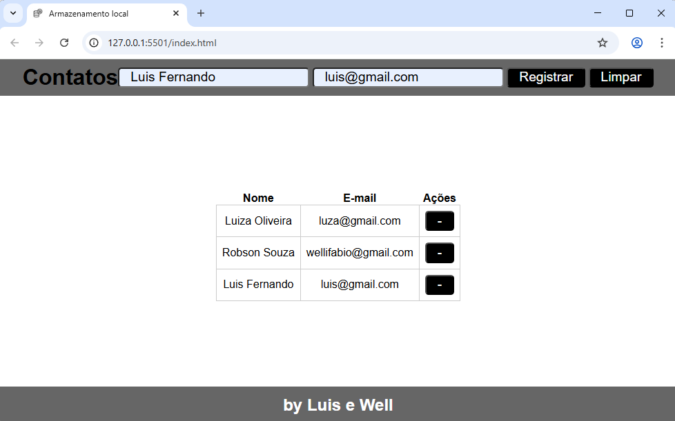

# Aula03 - DOM - Local Storage
- DOM (Objetos locais HTML)
- window.localStorage (Objeto de armazenamento local)

## Demonstração

- [Código visto em aula](./contatos/)
## Atividade
- No projeto visto em aula, acrescente no formulário e na tabela os campos:
    - Endereço, Telefone, RG e CPF
    - Acrescente um botão de ação em cada linha da tabela para editar
        - ao clicar no botão os dados da linha da tabela devem ser preenchidos no formulário, podendo ser editados e ao clicar em **Registrar** devem ser alterados na tabela.
    - Melhore a estilização CSS a sua escolha.

### Entrega
- Crie um repositório público github chamado pfe1-aula03 suba os códigos e habilite o gitpages.