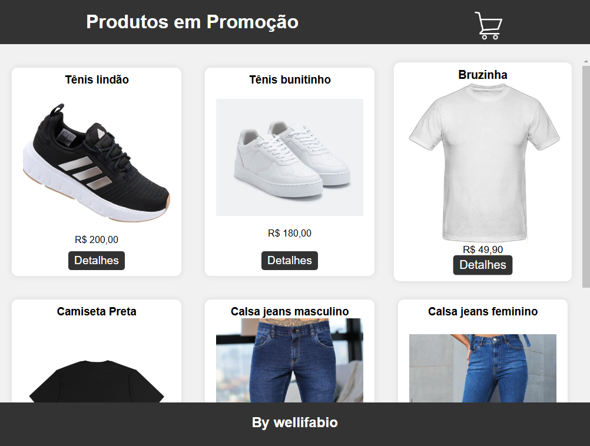
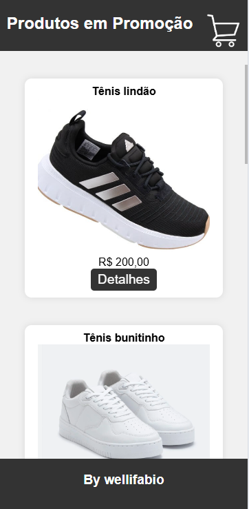
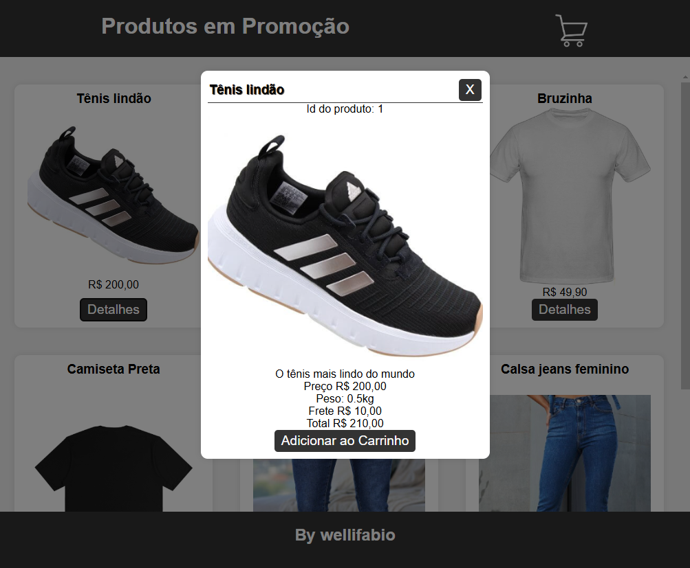
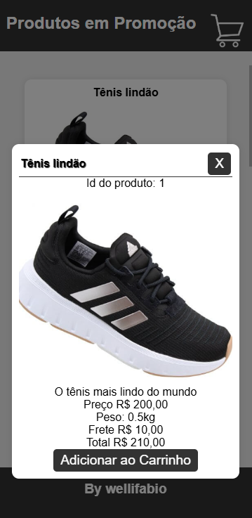
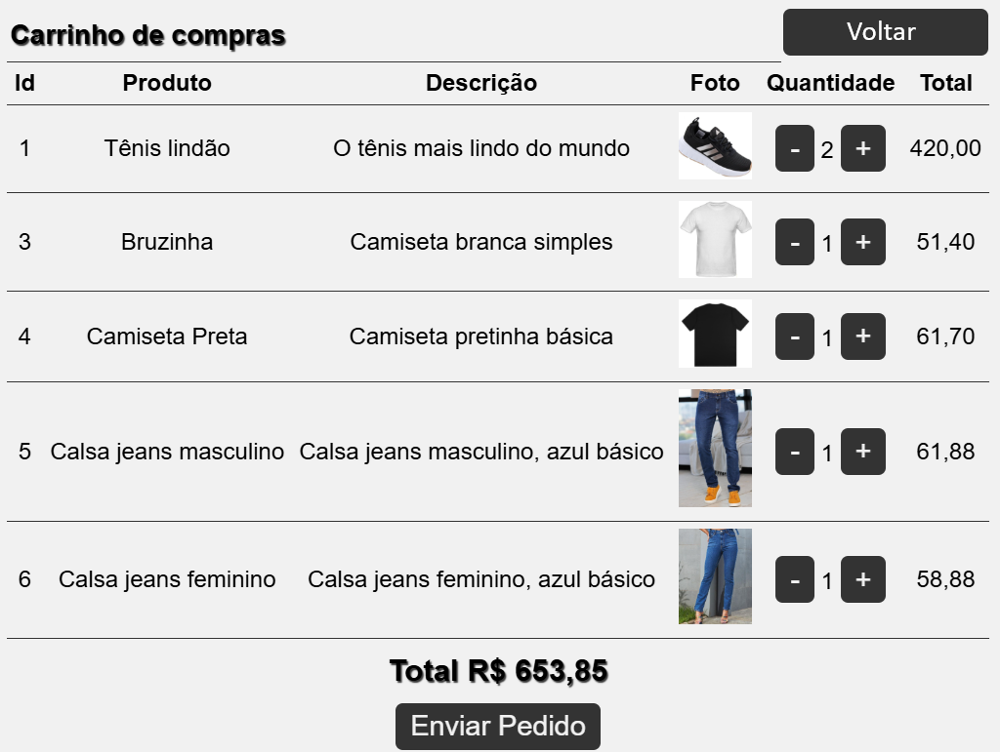
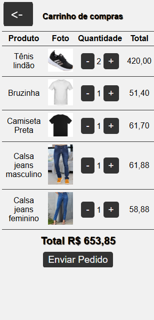

# Aula04 - VPF01
Verificação Pratica Formativa 01
## Contextualização
Sra. Mariana doa da loja de roupas **Mariana Vest** gostaria de um site para vender seus produtos. Você como programador(a) front-end foi incumbido de codificar um protótipo do **Carrinho de Compras**.

## Desafio
O P.O. criou os wireframes a seguir e você deve codificar o protótipo do carrinho de compras. O protótipo deve ser responsivo e funcionar em dispositivos móveis e desktop e utilizar as configurações abaixo:

### Configurações
- **HTML**: HTML5
- **CSS**: CSS3
- **JavaScript**: Vanilla JS

- Paleta de cores baseada em marroms e tons de azul:
    - #A0522D (SaddleBrown)
    - #8B4513 (SaddleBrown)
    - #D2691E (Chocolate)
    - #F4A460 (SandyBrown)
    - #FFDEAD (NavajoWhite)
- Fonte: Roboto (Google Fonts)

## Wireframes
|Web|Responsivo|
|-|-|
|||
|Página index.html com os produtos em formato de cards|index.html Responsivo|
|||
|Página index.html com os detalhes do produto em Modal|index.html Responsivo|
|||
|Página carrinho.html com os itens adicionados ao carrinho|carrinho.html Responsivo|

## Funcionalidades tela index.html
- [ ] A página deve ser carregada com os produtos em formato de cards (pelo menos 6 produtos provenientes do JSON abaixo), os produtos são apenas exemplos podem ser alterados, mas devem ter as seguintes informações: id, imagem, nome, descrição, preço, peso e frete.
```json
 [
    {
        "id": 1,
        "nome": "Tênis lindão",
        "descricao": "O tênis mais lindo do mundo",
        "preco": 200.00,
        "peso": 0.5,
        "frete": 0.1,
        "imagem": "https://wellifabio.github.io/produtos-cards/assets/tenis1.png"
    },
    {
        "id": 2,
        "nome": "Tênis bunitinho",
        "descricao": "O tênis mais bunitinho de hoje",
        "preco": 180.00,
        "peso": 0.5,
        "frete": 0.1,
        "imagem": "https://wellifabio.github.io/produtos-cards/assets/tenis2.png"
    },
    {
        "id": 3,
        "nome": "Bruzinha",
        "descricao": "Camiseta branca simples",
        "preco": 49.90,
        "peso": 0.3,
        "frete": 0.1,
        "imagem": "https://wellifabio.github.io/produtos-cards/assets/camiseta1.png"
    },
    {
        "id": 4,
        "nome": "Camiseta Preta",
        "descricao": "Camiseta pretinha básica",
        "preco": 59.90,
        "peso": 0.3,
        "frete": 0.1,
        "imagem": "https://wellifabio.github.io/produtos-cards/assets/camiseta2.png"
    },
    {
        "id": 5,
        "nome": "Calsa jeans masculino",
        "descricao": "Calsa jeans masculino, azul básico",
        "preco": 49.90,
        "peso": 1.2,
        "frete": 0.2,
        "imagem": "https://wellifabio.github.io/produtos-cards/assets/calsa1.png"
    },
    {
        "id": 6,
        "nome": "Calsa jeans feminino",
        "descricao": "Calsa jeans feminino, azul básico",
        "preco": 49.90,
        "peso": 0.9,
        "frete": 0.2,
        "imagem": "https://wellifabio.github.io/produtos-cards/assets/calsa2.png"
    }
]
```
- [ ] Ao clicar no botão **Detalhes** o produto deve abrir em um modal com as informações do produto (imagem, nome, descrição, preço, peso e frete).
    - [ ] O modal deve ter um botão **X** que fecha o modal.
    - [ ] O frete deve ser calculado com base no peso do produto e o valor do frete deve ser 10% do peso do produto (peso * 0.1). O valor do frete deve ser exibido no modal.
    - [ ] O preço deve ser exibido com duas casas decimais e o símbolo de R$ (ex: R$ 49,90).
- [ ] Ao clicar no botão **Adicionar ao Carrinho** o produto deve ser adicionado ao carrinho de compras (Uma lista que deve ser salva em localStorage para que possa ser vista na outra tela [carrinho.html]).

## Funcionalidades tela carrinho.html
- [ ] A página deve ser carregada com os produtos adicionados ao carrinho (provenientes do localStorage).
- [ ] O carrinho deve exibir os produtos adicionados com as seguintes informações: imagem, nome, preço e quantidade (a quantidade deve ser exibida em um campo de input do tipo number).
    - [ ] O carrinho deve permitir que o usuário altere a quantidade de cada produto (o valor deve ser salvo no localStorage).
    - [ ] O carrinho deve remover o produto do carrinho quando a quantidade for = 0.
- [ ] O carrinho deve exibir o valor total do carrinho (soma dos preços dos produtos multiplicados pela quantidade de cada produto). O valor total deve ser exibido com duas casas decimais e o símbolo de R$ (ex: R$ 49,90).
- [ ] Ao clicar no botão **Enviar pedido** o carrinho deve ser limpo (localStorage) e o usuário deve ser redirecionado para a página index.html com uma mensagem de sucesso (ex: "Pedido enviado com sucesso!").
- [ ] Ao clicar no botão **Voltar** ou **<-** deve apenas voltar a tela inicial sem limpar o carrinho, para continuar comprando.

## Entrega
- Ao concluir o projeto deve enviar para um repositório público no GitHub.
- Habilitar o GitHub Pages para o repositório e enviar o link do projeto para o professor.
- O projeto deve ser entregue até o dia 16/04/2025 [Neste formulário](https://docs.google.com/forms/d/e/1FAIpQLSeGIpadyDSD0r27YQ865PzfKYIbitqjGOtzUoeZ2kpCHT0s4Q/viewform?usp=dialog).

## Observações
- O projeto deve ser responsivo e funcionar em dispositivos móveis e desktop.
- As cores dos wireframes estão em escala de cinza, mas você deve usar as cores da paleta de cores acima.

## Critérios
|Criticidade|Capacidades Básicas e Socioemocionais|Critérios|
|-|:-:|-|
||1 Utilizar semântica de linguagem de marcação conforme normas|Separou os ítens como cabeçalho, conteúdo, menú, rodapé.|
||2 Elaborar formulários de página web|Criou formulários para cadastro em forma de modais ou como elemento dentro da página conforme solicitado|
||3 Utilizar ferramentas gráficas para interface web e mobile|Implementou funcionaidades HTML de responsividade apresentando o conteúdo tanto no tamanho web como mibile|
||4 Adequar a interface web para diferentes dispositivos de acesso|Implementou funcionaidades CSS de responsividade apresentando o conteúdo tanto no tamanho web como mibile|
||5 Desenvolver interfaces web interativas com linguagem de programação|Aplicou recursos de manipulação de janelas modais, carregou dados JSON, localStorage para persistência de dados|
||6 Aplicar técnicas de estilização de páginas web|Implementou técnicas de UI x UX com CSS|
||1 Demonstrar autogestão|Utilizou IA apenas como apoio tentando entender a solução, contou com ajuda de colegas ou ajudou com objetivo de melhorar o aprendizado|
||2 Demonstrar pensamento analítico|Compreende como o Front-end se relaciona com dados locais e externos, tirou dúvidas com instrutores se surgiram|
||3 Demonstrar inteligência emocional|Se dedicou ao aprendizado para compreender o mínimo do componente|
||4 Demonstrar autonomia|Questionou os intrutores ou colegas sobre dúvidas ou problemas ocorridos durante o desenvolvimento. Se propôs a resolver os problemas|