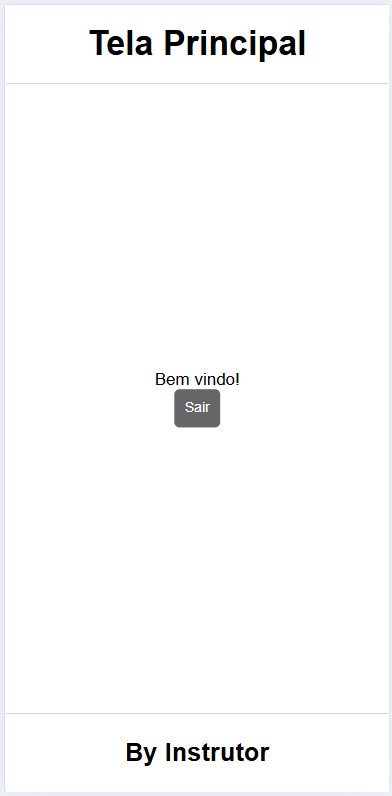

# Aula07 - Login

## Desafio
Conforme wireframes abaixo, crie duas telas, defina um login e uma senha, não conte ao professor. e deixe ele tentar fazer o login.

|||
|:-:|:-:|
|Tela de Login<br>(login.html)|Tela Home<br>(home.html)|

Caso os dados estiverem incorretos mostrar um alert com a mensagem "Dados de email e senha não conferem" e se estiverem corretos direcionar para a página "home.html"

- Obs: O instrutor não vai olhar seu código no VsCode, porém vai inspecionar elementos no navegador.

## Entrega
Crie um repositório no GitHub com o nome `aula07-login` e suba o código fonte do desafio, habilite o GitHub Pages e envie o [link neste formulário](https://docs.google.com/forms/d/e/1FAIpQLScwmv6vc28Nr4eU4kl7qudeWdACVifoaxKpSMLAxR-ktDcpIw/viewform?usp=dialog) para que o professor possa acessar o seu site.

### Criptografia e JWT
Somente com front-end não é possível garantir a segurança dos dados do usuário, por isso é necessário utilizar criptografia para proteger as informações sensíveis, como senhas. O JWT (JSON Web Token) é uma forma de autenticação que permite que o servidor gere um token assinado digitalmente, que pode ser enviado ao cliente e utilizado para autenticar requisições subsequentes.

## Meio alternativo
Caso só tenha como publicar um site estático, como no [GitHub Pages](https://pages.github.com/) e precise de um meio de login, pode utilizar o [Firebase Authentication](https://firebase.google.com/docs/auth) para autenticação de usuários. O Firebase oferece uma solução completa de autenticação, incluindo suporte a e-mail/senha, redes sociais e autenticação anônima. É uma alternativa prática para projetos que não exigem um back-end completo.

## Em último caso
Podemos utilizar um hash SHA-256 para criptografar a senha do usuário, mas isso não é recomendado para produção, pois não oferece a mesma segurança que o JWT. O SHA-256 é um algoritmo de hash criptográfico que gera um valor fixo de 256 bits a partir de uma entrada de dados. Ele é amplamente utilizado para verificar a integridade dos dados, mas não é adequado para autenticação de usuários.
- Exemplo de uso do SHA-256, implementado pela aluna **Steffany**:
```html
<html lang="pt-br">
<head>
    <meta charset="UTF-8">
    <meta name="viewport" content="width=device-width, initial-scale=1.0">
    <title>Tela de Login</title>
</head>
<body>
    <header>
        <h1>Tela de Login</h1>
    </header>
    
    <div class="container">
        <div class="login-form">
            <div class="form-group">
                <label for="email">E-mail</label>
                <input type="email" id="email" placeholder="Digite seu email">
            </div>
            <div class="form-group">
                <label for="senha">Senha</label>
                <input type="password" id="senha" placeholder="Digite sua senha">
            </div>
            <button class="btn" onclick="validarLogin()">Entrar</button>
        </div>
    </div>
    
    <footer>
        <p>By Instrutor</p>
    </footer>

    <script>
        async function gerarHash(senha) {
            const encoder = new TextEncoder();
            const data = encoder.encode(senha);
            const hashBuffer = await window.crypto.subtle.digest('SHA-256', data);
            const hashArray = Array.from(new Uint8Array(hashBuffer));
            const hashHex = hashArray.map(b => b.toString(16).padStart(2, '0')).join('');
            return hashHex;
        }

        async function validarLogin() {
            const emailCorreto = "tinkbell1910@gmail.com";
            const senhaCorretaHash ="f99e17147eaae1c8963af45dbbd70410729488ef3c1f0adba93fa7954e881335";

            const email = document.getElementById('email').value;
            const senha = document.getElementById('senha').value;
            const senhaHash = await gerarHash(senha);

            if (email === emailCorreto && senhaHash === senhaCorretaHash) {
                localStorage.setItem('logado', 'true'); 
                window.location.href = "home.html";
            } else {
                alert("E-mail ou senha incorretos!");
            }
        }
    </script>
</body>
</html>
```