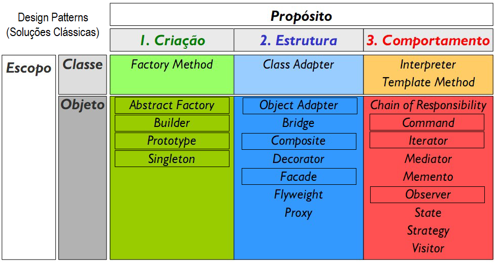

# Aula07 - Gof
## Design Patterns
- Soluções clássicas baseadas no livro Gof (Gang of four, "A gangue dos 4")
- São 23 soluções clássicas divididas em três categorias (Criação, Estrutura, Comportamento).

|Gof - Patterns|
|-|
|

## Exemplos
#### [Exemplo Manual Composite e Builder](./gof/BuilderComposite.md)
#### [Exemplo Prisma Singleton, Composite e Builder](./gof/README.md)

## Atividades
Em grupos de duas a três pessoas, escolha uma solução classica, comunique-se com os colegas de sala para não escolherem os mesmos patterns. estude a solução.
Monte uma pequena apresentação/demonstração para explicar para a turma após o almoço.
- Semelhante ao que fizemos na [aula de hoje](./gof/README.md).
### Entrega
- Crie um repositorio no git chamado "patterns-nome-do-pattern"
- Crie um arquivo README.md com a pesquisa/apresentação.
- Coloque os arquivos necessários neste repositório
#### [Link do forms para entrega](https://docs.google.com/forms/d/e/1FAIpQLSed1z9aLJyOqwte9SR7nKioiAKLBRRgkra3f_GfB-bbRWvnuw/viewform?usp=dialog)

### Apresentações
|Grupo|Tipo|Pattern|
|-|-|-|
|Mellyssa e Pedro Duarte|Criação|[Abstract Factory](https://github.com/PedroDuarte2007/Abstratc_Factory)|
|Beatriz, Catarina e Kathleen|Estrutura|[Composite](https://mirandakathleen.github.io/modeloComposite)|
|Lizzie, William, Fernando e João Pedro|Estrutura|[Facade](https://github.com/nandinho019/facade)|
|Crislaine e Rebeca Lazarini|Comportamento|[Observer](https://github.com/rebecalazarini/patterns-Observer)|