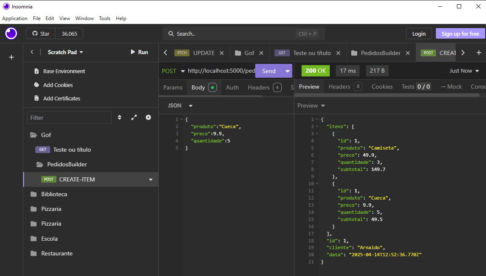

# Diagrama de classes para os exemplos a seguir

### Exemplo do pattern **Criação - Builder** nas classes Pedido e Item
- builderPedido.js
```js
class Pedido{

    itens = [];

    constructor(id, cliente) {
        this.id = id;
        this.cliente = cliente;
        this.data = new Date();
    }

    addItem(item) {
        this.itens.push(item);
    }
}

module.exports = Pedido;
```
- builderItem
```js
class Item{
    constructor(id, produto, preco, quantidade) {
        this.id = id;
        this.produto = produto;
        this.preco = preco;
        this.quantidade = quantidade;
        this.subtotal = this.calcularSubtotal();
    }
    calcularSubtotal() {
        return this.preco * this.quantidade;
    }
}

module.exports = Item;
```
### Exemplo do pattern **Estrutura - Composite** de estrutura
```js
const Pedido = require('../models/builderPedido');
const Item = require('../models/builderItem');

const pedido = new Pedido(1, "Arnaldo");

const readPedido = async (req, res) => {
    res.json(pedido);
}

const createItem = async (req, res) => {
    const { produto, preco, quantidade } = req.body;
    const item = new Item(pedido.itens.length + 1, produto, preco, quantidade)
    pedido.addItem(item);
    res.json(pedido);
}

module.exports = {
    readPedido,
    createItem
};
```
