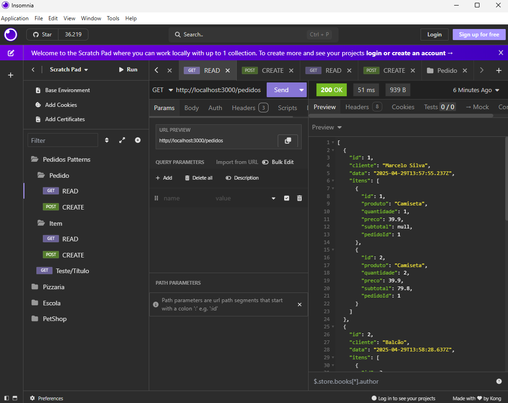

# Exemplo de Design Patterns
- Singleton (Criação)
- Builder (Criação)
- Composite (Estrutural)

## Exemplos Node.js
- O **ORM (Object Relational Mapping) Prisma** já possui implícitamente vários patterns de projeto, como o Repository Pattern e o Data Mapper Pattern, também o Singleton Pattern, que é utilizado para garantir que uma classe tenha apenas uma instância e fornecer um **ponto de acesso global** a ela.

### Um exemplo do pattern Singleton está no arquivo .env
```js
DATABASE_URL="mysql://root@localhost:3306/pedidos"
```

### Exemplo do pattern Builder
./models/pedido.js
```js
class PedidoBuilder{
    constructor(){
        this.cliente = "Balcão";
    }
}

module.exports = new PedidoBuilder();
```
.controller/pedido.js
```js
const { PrismaClient } = require('@prisma/client');
const prisma = new PrismaClient();
const pedido = require('../models/pedido');

const create = async (req, res) => {
    try {
        const { cliente } = req.body;
        //Se não informar o cliente, o pedido é criado como "Balcão" (Patthern Builder)
        if (!cliente) {
            const ped = await prisma.pedido.create({ data: pedido });
            res.status(201).json(ped);
        } else {
            //Senão, o pedido é criado com os dados informados no body (corpo da requisição)
            const ped = await prisma.pedido.create({ data: req.body });
            res.status(201).json(ped);
        }
    }catch (e) {
        res.status(500).json(e.message);
    }
}

const read = async (req, res) => {
    const pedidos = await prisma.pedido.findMany();
    res.json(pedidos);
}

module.exports = {
    create,
    read
}
```
- Neste exemplo o padrão Builder é utilizado para criar um pedido com o cliente "Balcão" por padrão, caso não seja informado um cliente no corpo da requisição. O padrão Builder é útil para construir objetos complexos de forma mais legível e organizada.

### Exemplo do pattern Composite
- Com o ORM Prisma este pattern é utilizado para criar uma estrutura de dados em árvore, onde cada nó pode ser um objeto simples ou um objeto composto por outros objetos. O padrão Composite é útil para representar hierarquias de objetos e tratar objetos individuais e composições de forma uniforme.
- No arquivo ./controller/pedido.js
```js
const { PrismaClient } = require('@prisma/client');
const prisma = new PrismaClient();
const pedido = require('../models/pedido');

const create = async (req, res) => {
    try {
        const { cliente } = req.body;
        //Se não informar o cliente, o pedido é criado como "Balcão" (Patthern Builder)
        if (!cliente) {
            const ped = await prisma.pedido.create({ data: pedido });
            res.status(201).json(ped);
        } else {
            //Senão, o pedido é criado com os dados informados no body (corpo da requisição)
            const ped = await prisma.pedido.create({ data: req.body });
            res.status(201).json(ped);
        }
    }catch (e) {
        res.status(500).json(e.message);
    }
}

const read = async (req, res) => {
    const pedidos = await prisma.pedido.findMany({
        include: {
            itens: true,
        }
    });
    res.json(pedidos);
}

module.exports = {
    create,
    read
}
```
- Neste exemplo basta utilizar o include: { itens: true } para incluir os itens do pedido na consulta. O padrão Composite é útil para representar hierarquias de objetos e tratar objetos individuais e composições de forma uniforme.
<br>