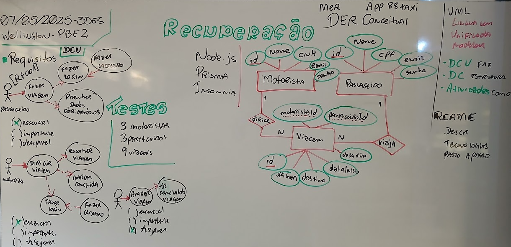
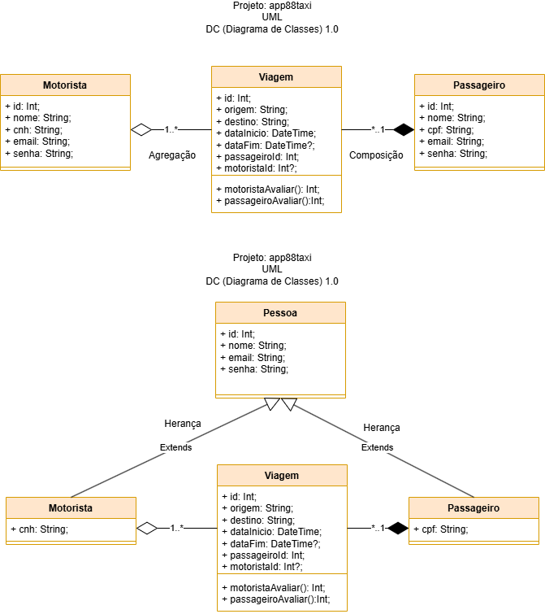

# Aula08 - Recuperação
## Projeto: app88taxi

## Contextualização
O sr. Juan Pablo, precisa de um aplicativo de transporte de passageiros, você faz parte de uma equipe SCRUM como programador o backend. O PM (Product Manager) da equipe elaborou o seguinte DC.


## Desafio
Desenvolva o Backend do aplicativo de transporte de passageiros, utilizando o framework **Node.js** e o ORM **Prisma**. O banco de dados utilizado será o **MySQL**. O projeto deve ser desenvolvido em **JavaScript** e o ORM **Prisma** deve ser utilizado para realizar as operações de CRUD (Create, Read, Update, Delete) no banco de dados.

## Casos de Teste
Para testar o projeto, utilize o Postman ou o Insomnia. O projeto deve conter os seguintes casos de teste:
- [CT001]**Cadastrar pelo menos 3 passageiros**
- [CT002]**Cadastrar pelo menos 3 motoristas**
- [CT003]**Cadastrar pelo menos 9 viagens**

## [Repositório do projeto](https://github.com/wellifabio/seduc-3des-pbe2-app88taxi-2025.git)

## Iniciando um novo projeto
- 1º Criar um repositório no GitHub.
- 2º Clonar o repositório.
- 3º Abrir com o **VsCode**.
- 4º Criar uma pasta **api**
- 5º Criar um README.md
    - Descrição do projeto.
    - Tecnologias utilizadas.
    - Passos para executar o projeto.
- 6º No VsCode abrir o terminal e executar os comandos:
```bash
cd api
npm init -y
npm install express cors dotenv
npx prisma init --datasource-provider mysql
```
- 7º Criar o arquivo **.env** com as variáveis de ambiente:
```bash
DATABASE_URL="mysql://root@localhost:3306/app88taxi"
```