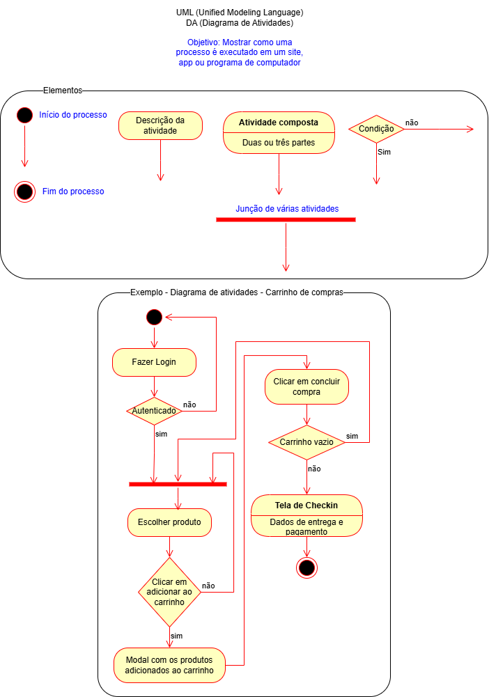

# Aula10 - JWT - JSON Web Token

## Atividade01
Em grupos de enalise este projeto [back-end](https://github.com/wellifabio/3des-login-auth-2025.git), faça **fork**, clone o seu repositório no seu computador, analise o código e acrescente no **README.md** do seu repositório as seguintes informações:

- Estude e documente a estrutura do projeto.
    - Detalhando quais as bibliotecas utilizadas.
    - Explicando o que cada uma faz.
    - Analise o código e documente o que cada rota faz.
- Documentar descrição do funcionamento utilizando UML DA(Diagrama de Atividades).

### Diagrama de Atividades
O diagrama de atividades é uma representação gráfica que descreve o fluxo de atividades dentro de um sistema. Ele é útil para visualizar o processo.
<br>

## Para testar
- Instale as dependências, execute com nodemon e teste a **api** com **Insomnia**.
```bash
cd api
npm install
npx nodemon
```

## Entrega
- Ao concluir o desenvolvimento, faça **commit** do README.md no seu repositório público, feito fork, para que o professor possa avaliar.

### Criptografia e JWT
Somente com front-end não é possível garantir a segurança dos dados do usuário, por isso é necessário utilizar criptografia para proteger as informações sensíveis, como senhas. O JWT (JSON Web Token) é uma forma de autenticação que permite que o servidor gere um token assinado digitalmente, que pode ser enviado ao cliente e utilizado para autenticar requisições subsequentes.

## Meio alternativo
Caso só tenha como publicar um site estático, como no [GitHub Pages](https://pages.github.com/) e precise de um meio de login, pode utilizar o [Firebase Authentication](https://firebase.google.com/docs/auth) para autenticação de usuários. O Firebase oferece uma solução completa de autenticação, incluindo suporte a e-mail/senha, redes sociais e autenticação anônima. É uma alternativa prática para projetos que não exigem um back-end completo.

## Em último caso
Podemos utilizar um hash SHA-256 para criptografar a senha do usuário, mas isso não é recomendado para produção, pois não oferece a mesma segurança que o JWT. O SHA-256 é um algoritmo de hash criptográfico que gera um valor fixo de 256 bits a partir de uma entrada de dados. Ele é amplamente utilizado para verificar a integridade dos dados, mas não é adequado para autenticação de usuários.
- Exemplo de uso do SHA-256, implementado pela aluna **Steffany**:
```js
async function gerarHash(senha) {
    const encoder = new TextEncoder();
    const data = encoder.encode(senha);
    const hashBuffer = await window.crypto.subtle.digest('SHA-256', data);
    const hashArray = Array.from(new Uint8Array(hashBuffer));
    const hashHex = hashArray.map(b => b.toString(16).padStart(2, '0')).join('');
    return hashHex;
}

async function validarLogin() {
    const emailCorreto = "tinkbell1910@gmail.com";
    const senhaCorretaHash ="f99e17147eaae1c8963af45dbbd70410729488ef3c1f0adba93fa7954e881335";

    const email = document.getElementById('email').value;
    const senha = document.getElementById('senha').value;
    const senhaHash = await gerarHash(senha);

    if (email === emailCorreto && senhaHash === senhaCorretaHash) {
        localStorage.setItem('logado', 'true'); 
        window.location.href = "home.html";
    } else {
        alert("E-mail ou senha incorretos!");
    }
}
```