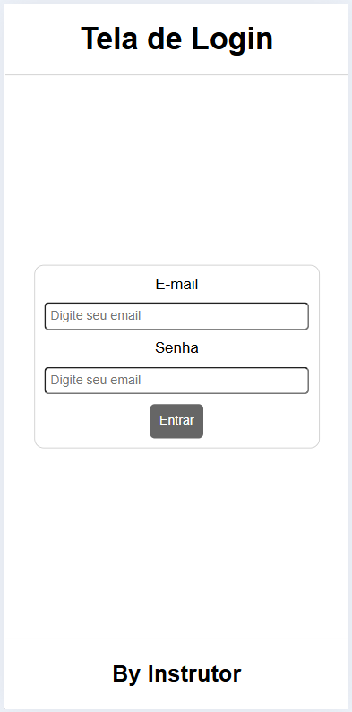
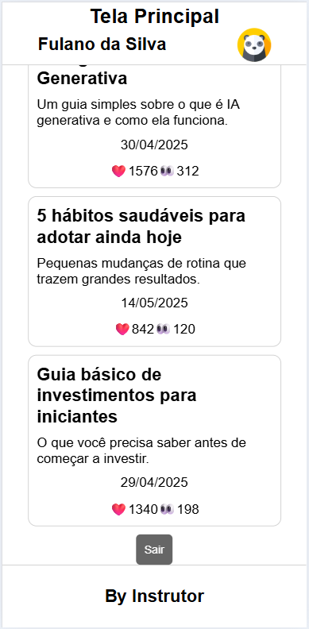

# Aula10 - JWT - JSON Web Token

## Atividade01
Em grupos faça uma análise [deste projeto back-end](https://github.com/wellifabio/3des-login-auth-2025.git), faça **fork**, clone o seu repositório no seu computador, analise o código e acrescente no **README.md** do seu repositório as seguintes informações:

- Estude e documente a estrutura do projeto.
    - Detalhando quais as bibliotecas utilizadas.
    - Explicando o que cada uma faz.
    - Analise o código e documente o que cada rota faz.
- Documentar descrição do funcionamento utilizando UML DA(Diagrama de Atividades).

### Diagrama de Atividades
O diagrama de atividades é uma representação gráfica que descreve o fluxo de atividades dentro de um sistema. Ele é útil para visualizar o processo.
<br>

## Para testar
- Instale as dependências, execute com nodemon e teste a **api** com **Insomnia**.
```bash
cd api
npm install
npx nodemon
```
## Atividade 02
- Com os conhecimentos adquiridos desenvolva um front-end com duas telas (login.html e home.html) e autentique com uma api Node.js com JWT(JSON web Token), pode utilizar a mesma API desta aula.
- Na página Home mostre a lista de posts obtidas da API, lembre-se que para obter resposta no verbo get na rota 'http://localhost:300/posts' você precisa enviar o bearer-token.

|||
|:-:|:-:|
|Tela de Login<br>(index.html)|Tela Home<br>(home.html)|

## Entrega
- Ao concluir o desenvolvimento, faça **commit** do README.md no seu repositório público, feito fork, para que o professor possa avaliar.
