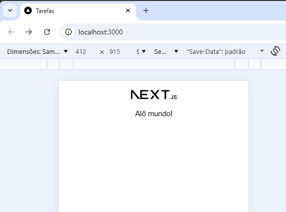

# Aula11 - Next.JS

## O que é Next.JS
Next.js é um framework React que fornece ferramentas e recursos para construir aplicações web rápidas e otimizadas, adicionando funcionalidades como Server-Side Rendering (SSR), roteamento automático (file-system routing), otimização de imagens e API Routes, resolvendo limitações do React tradicional para projetos prontos para produção e melhorando performance e SEO

## Iniciando um novo projeto com Next.JS e Prisma
- 1 Abra o git bash e execute o seguinte comando:
```bash
npx create-next-app@latest nome-do-seu-projeto
```
- 2  O npx: Executa o pacote create-next-app, garantindo a versão mais recente.
- 3 Responda **yes** às Perguntas:
  - Would you like to use the recommended Next.js defaults? » Yes
- 4 Acesse o Projeto: Após a instalação, navegue para a pasta do projeto e abra com o VsCode:
```bash
cd nome-do-seu-projeto
code .
```
- 5 Instale o Prisma, modele o schema.prisma, .env e seed.
```bash
npx prisma init --datasource-provider mysql
npm i @prisma/client 
```
- 6 Próximos Passos:
    - Roteamento: Crie pastas dentro de `app/` para criar novas rotas automaticamente (ex: app/sobre/page.js para a rota /sobre).
    - edite o arquivo `page.tsx`
```tsx
import Image from "next/image";

export default function Home() {
  return (
    <div className="w-full h-full flex flex-col items-center justify-between">
      <header>
        <Image
          className="dark:invert m-5"
          src="/next.svg"
          alt="Next.js logo"
          width={100}
          height={20}
          priority
        />
      </header>
      <main>
        Alô mundo!
      </main>
      <footer></footer>
    </div>
  );
}
```
- O arquivo `layout.tsx` configura a base das páginas do projeto
```tsx
import type { Metadata } from "next";
import { Geist, Geist_Mono } from "next/font/google";
import "./globals.css";

const geistSans = Geist({
  variable: "--font-geist-sans",
  subsets: ["latin"],
});

const geistMono = Geist_Mono({
  variable: "--font-geist-mono",
  subsets: ["latin"],
});

export const metadata: Metadata = {
  title: "Tarefas",
  description: "App de gestão de tarefas por usuário",
};

export default function RootLayout({
  children,
}: Readonly<{
  children: React.ReactNode;
}>) {
  return (
    <html lang="en">
      <body
        className={`${geistSans.variable} ${geistMono.variable} antialiased`}
      >
        {children}
      </body>
    </html>
  );
}
```

- 7 Inicie o Servidor de Desenvolvimento:
```bash
npm run dev
```
- Seu projeto Next.js estará rodando em http://localhost:3000.
<br>
- Agora é começar a codificar