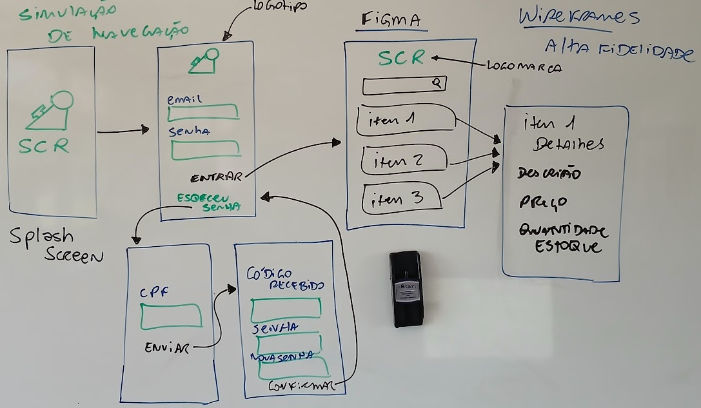

# Aula06 - Prototipação

## Wireframes
- Wireframe é um esboço visual de uma interface de usuário, que representa a estrutura e o layout de uma página ou aplicativo.
- Ele é usado para planejar a disposição dos elementos, como botões, menus e campos de entrada, sem se preocupar com detalhes de design visual.
### Wireframes Esboçados
- Wireframes esboçados são representações visuais mais detalhadas e refinadas de um layout de interface, que incluem elementos como cores, tipografia e imagens.
### Wireframes de alta fidelidade
- Wireframes de alta fidelidade são representações quase finais de uma interface, que mostram como a interação do usuário funcionará e como os elementos visuais se comportarão.

## Protótipo funcional
- Protótipo funcional é uma versão interativa de um produto ou sistema, que simula a experiência do usuário e permite testar a usabilidade e a funcionalidade antes do desenvolvimento final.

## [Figma](https://www.figma.com/) Ferramenta de Design
- Figma é uma ferramenta de design colaborativo baseada na web, que permite criar wireframes, protótipos e interfaces de usuário de forma interativa.

## Demonstração com reprodução prática
A partir do wireframe desenhado/esboçado na lousa abaixo, vamos reproduzir o mesmo no Figma. Criando um protótipo funcional.
 