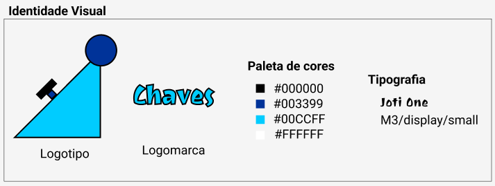
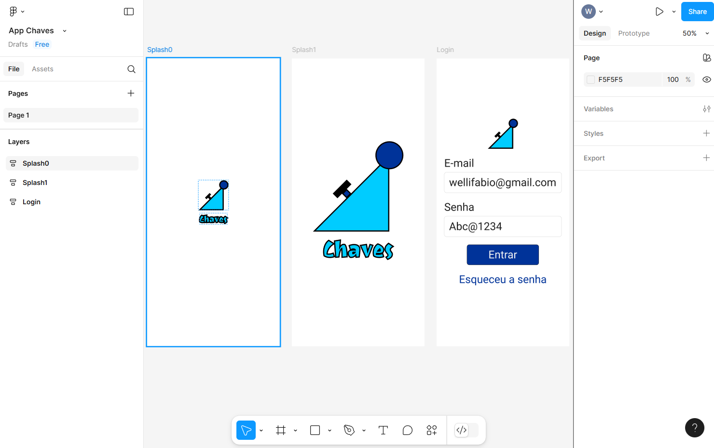
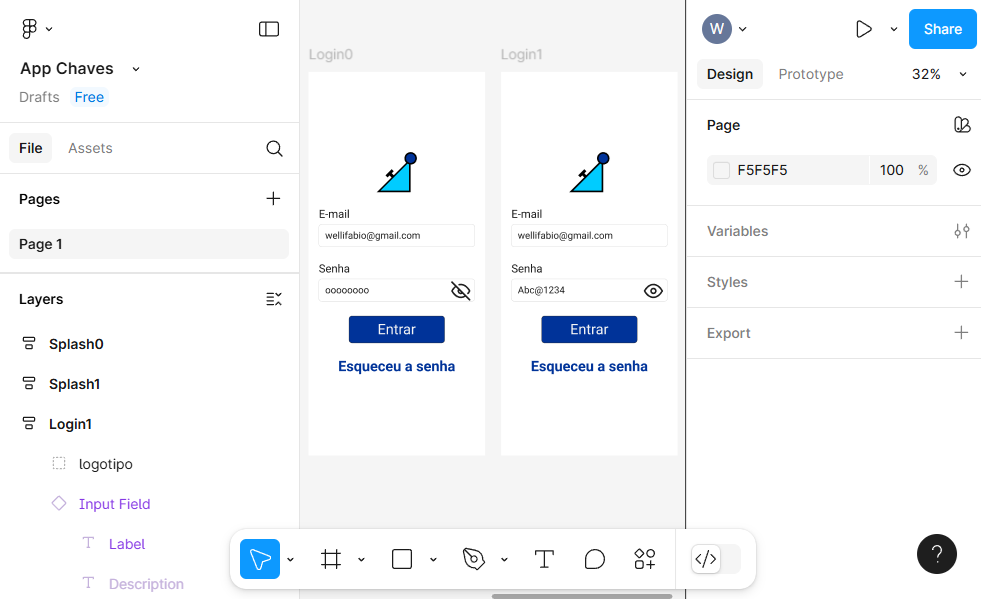
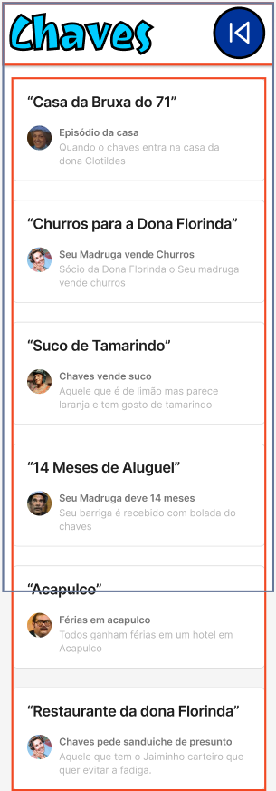
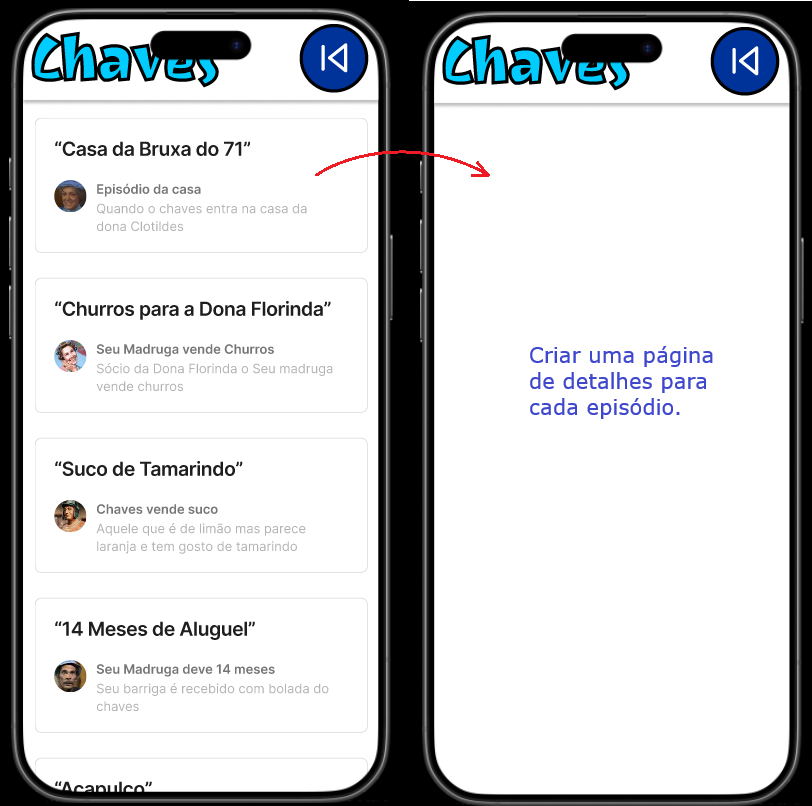

# Aula06 - Prototipação

## Wireframes
- Wireframe é um esboço visual de uma interface de usuário, que representa a estrutura e o layout de uma página ou aplicativo.
- Ele é usado para planejar a disposição dos elementos, como botões, menus e campos de entrada, sem se preocupar com detalhes de design visual.
### Wireframes Esboçados
- Wireframes esboçados são representações visuais mais detalhadas e refinadas de um layout de interface, que incluem elementos como cores, tipografia e imagens.
### Wireframes de alta fidelidade
- Wireframes de alta fidelidade são representações quase finais de uma interface, que mostram como a interação do usuário funcionará e como os elementos visuais se comportarão.

## Protótipo funcional
- Protótipo funcional é uma versão interativa de um produto ou sistema, que simula a experiência do usuário e permite testar a usabilidade e a funcionalidade antes do desenvolvimento final.

## [Figma](https://www.figma.com/) Ferramenta de Design
- Figma é uma ferramenta de design colaborativo baseada na web, que permite criar wireframes, protótipos e interfaces de usuário de forma interativa.

## Demonstração com reprodução prática
A partir do wireframe desenhado/esboçado na lousa abaixo, vamos reproduzir o mesmo no Figma. Criando um protótipo funcional.
 

### Identidade Visual

  Inicialmente precisamos definir a identidade visual do projeto, conforme exemplo acima:
  Os elementos da indentidade visual devem ser salvos separadamente em uma pasta "assets" dentro do projeto, para facilitar a importação no figma.
  Podemos utilizar oitras ferramentas como **Canva**, **Photoshop**, Illustrator, entre outras para criar a identidade visual do projeto.

### Splash Screen e Tela de Login
- 1 Abrir o figma e criar um novo Design.
- 2 Criar um novo Frame (Tamanho: iPhone 14 Pro) e nomeá-lo como "Slpash0".
- 3 Duplicar o Frame "Slpash0" e nomeá-lo como "Slpash1", modificar o tamanho dos elementos do splahs (Logotipo e Logomarca).
- 4 Clicar em prototype e aplicar um efeito "after delay" de 800ms, para o Frame "Slpash1".
- 5 Criar um novo Frame (Tamanho: iPhone 14 Pro) e nomeá-lo como "Login".
- 6 Na aba esquerda clicar em "Assets" e buscar por "Input" e arrastar os elementos para a área vazia da tela e após editar arrastar para o Frame "Login".
 

### Simulação de exibição de senha

- 1 Desenhar duas telas de Login, uma com a senha visível e outra com a senha oculta.
- 2 Aplicar efeito "Touch down" no botão "Olho" para alternar entre a tela "login0" e "login1" e "Touch up" para voltar para a tela "login0".

### Rolagem de tela
|Tela|Processo|
|-|-|
||1 Cria conteúdos maiores do que o tamanho da tela 2 Marcar os elementos que não devem rolar em "Prototype >> Scroll behavior >> Fixed" 3 Ainda em Prototype clicar no frame e habilitar a rolagem vertical ou horizontal|

### [Link do App Chaves - Demonstração de aula](https://www.figma.com/design/XXfXuoXy8hPNhjEfaTGIag/App-Chaves?node-id=0-1&t=qeG3925r7voqeYug-1)

## Atividades

 Use sua criatividade.