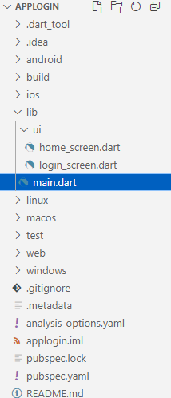

# Aula08 - Fluter

- Projeto: App Login
- Ambiente Local - Android Studio
- Ambiente Web - [IDX](https://idx.google.com)


## Hello World
- main.dart
```dart
import 'package:flutter/material.dart';
void main() {
  runApp(const MaterialApp(
    title: 'Hello World',
    home: Scaffold(
      appBar: AppBar(title: Text('Hello World')),
      body: Center(
        child: Text('Hello World'),
      ),
    ),
  ));
}
```


## Exemplo de um app de Login Básico
- Estrutura do projeto

||||
|-|-|-|
|Estrutura|Tela de login|Tela Home|

- main.dart
```dart
import 'package:applogin/ui/login_screen.dart';
import 'package:flutter/material.dart';

void main(){
  runApp(const MaterialApp(title:'Login App',home: LoginScreen()));
}
```
- login_screen.dart
```dart
import 'package:flutter/material.dart';

class LoginScreen extends StatefulWidget {
  const LoginScreen({super.key});

  @override
  State<LoginScreen> createState() => _LoginScreenState();
}

class _LoginScreenState extends State<LoginScreen> {
  @override
  Widget build(BuildContext context) {
    return Scaffold(
      appBar: AppBar(title:Text('Tela de Login'),backgroundColor: Colors.blueGrey),
      body: Center(
        child: Column(
          mainAxisAlignment: MainAxisAlignment.spaceEvenly,
          children: [
            Text(
              'Email',
              style: TextStyle(fontSize: 18, color: Colors.blueGrey),
            ),
            TextField(
              decoration: InputDecoration(border:OutlineInputBorder(), labelText: 'Digite seu e-mail'),
            ),
            Text(
              'Senha',
              style: TextStyle(fontSize: 18, color: Colors.blueGrey),
            ),
            TextField(
              obscureText: true,
              decoration: InputDecoration(border:OutlineInputBorder(), labelText: 'Digite sua senha'),
            ),
            ElevatedButton(onPressed: (){}, child: Text('Entrar'))
          ],
        ),
      ),
    );
  }
}

```
- home_screen.dart
```dart
import 'package:flutter/material.dart';

class HomeScreen extends StatelessWidget {
  const HomeScreen({super.key});

  @override
  Widget build(BuildContext context) {
    return Scaffold(
      appBar: AppBar(title:Text('Tela Principal'),backgroundColor: Colors.blueGrey),
      body: Center(
        child: Column(
          mainAxisAlignment: MainAxisAlignment.spaceEvenly,
          children: [
            Text(
              'Tela Principal',
              style: TextStyle(fontSize: 22, color: Colors.blueGrey),
            ),
            ElevatedButton(onPressed: (){}, child: Text('Sair'))
          ],
        ),
      ),
    );
  }
}

```
- Acima temos os códigos apenas de cada tela do app, onde temos a tela de login e a tela principal.
- As telas ainda não estão conectadas, ou seja, ao clicar no botão "Entrar" não acontece nada.

## Conectando as telas
- Para conectar as telas, precisamos importar a tela principal na tela de login e criar uma função para navegar entre as telas.
### Conexão simples sem validar dados de email e senha
Usando o Navigator.push() sem esquecer de importar a tela Home.
```dart
ElevatedButton(
  onPressed: () {
    //Navegar para a tela Home sem validar email e senha
    Navigator.push(
      context,
      MaterialPageRoute(builder: (context) => const HomeScreen()),
    );
  },
```
- Agora vamos fazer a validação de email e senha.
### Conexão com validação de dados
- Para validar os dados, vamos criar uma função que verifica se o email e a senha estão corretos com os dados abaixo:
```
email: aluno@email.com
senha: senha123
```
- login_screen.dart
```dart
import 'package:applogin/ui/home_screen.dart';
import 'package:flutter/material.dart';

class LoginScreen extends StatefulWidget {
  const LoginScreen({super.key});

  @override
  State<LoginScreen> createState() => _LoginScreenState();
}

class _LoginScreenState extends State<LoginScreen> {
  String email = '';
  String senha = '';

  @override
  Widget build(BuildContext context) {
    return Scaffold(
      appBar: AppBar(
        title: Text('Tela de Login'),
        backgroundColor: Colors.blueGrey,
      ),
      body: Center(
        child: Column(
          mainAxisAlignment: MainAxisAlignment.spaceEvenly,
          children: [
            Text(
              'Email',
              style: TextStyle(fontSize: 18, color: Colors.blueGrey),
            ),
            TextField(
              decoration: InputDecoration(
                border: OutlineInputBorder(),
                labelText: 'Digite seu e-mail',
              ),
              onChanged: (value) {
                setState(() {
                  email = value;
                });
              },
            ),
            Text(
              'Senha',
              style: TextStyle(fontSize: 18, color: Colors.blueGrey),
            ),
            TextField(
              obscureText: true,
              decoration: InputDecoration(
                border: OutlineInputBorder(),
                labelText: 'Digite sua senha',
              ),
              onChanged: (value) {
                setState(() {
                  senha = value;
                });
              },
            ),
            ElevatedButton(
              onPressed: () {
                if (email == 'aluno@email.com' && senha == 'senha123') {
                  Navigator.push(
                    context,
                    MaterialPageRoute(builder: (context) => const HomeScreen()),
                  );
                } else {
                  ScaffoldMessenger.of(context).showSnackBar(
                    SnackBar(
                      content: Text('E-mail ou senha incorretos!'),
                      duration: Duration(seconds: 2),
                    ),
                  );
                }
              },
              child: Text('Entrar'),
            ),
          ],
        ),
      ),
    );
  }
}
```
- home_screen.dart
```dart
import 'package:flutter/material.dart';

class HomeScreen extends StatelessWidget {
  const HomeScreen({super.key});

  @override
  Widget build(BuildContext context) {
    return Scaffold(
      appBar: AppBar(
        title: Text('Tela Principal'),
        backgroundColor: Colors.blueGrey,
      ),
      body: Center(
        child: Column(
          mainAxisAlignment: MainAxisAlignment.spaceEvenly,
          children: [
            Text(
              'Tela Principal',
              style: TextStyle(fontSize: 22, color: Colors.blueGrey),
            ),
            ElevatedButton(
              onPressed: () {
                Navigator.pop(context);
              },
              child: Text('Sair'),
            ),
          ],
        ),
      ),
    );
  }
}
```

### [Link do projeto no GitHub](https://github.com/wellifabio/3DES-PDM1-applogin-estatico-2025.git)