# Aula08 - Fluter

- Projeto: App Login
- Ambiente Local - Android Studio
- Ambiente Web - [IDX](https://idx.google.com)


## Hello World
- main.dart
```dart
import 'package:flutter/material.dart';
void main() {
  runApp(const MaterialApp(
    title: 'Hello World',
    home: Scaffold(
      appBar: AppBar(title: Text('Hello World')),
      body: Center(
        child: Text('Hello World'),
      ),
    ),
  ));
}
```


## Exemplo de um app de Login Básico
- Estrutura do projeto

||||
|-|-|-|
|Estrutura|Tela de login|Tela Home|

- main.dart
```dart
import 'package:applogin/ui/login_screen.dart';
import 'package:flutter/material.dart';

void main(){
  runApp(const MaterialApp(title:'Login App',home: LoginScreen()));
}
```
- login_screen.dart
```dart
import 'package:flutter/material.dart';

class LoginScreen extends StatefulWidget {
  const LoginScreen({super.key});

  @override
  State<LoginScreen> createState() => _LoginScreenState();
}

class _LoginScreenState extends State<LoginScreen> {
  @override
  Widget build(BuildContext context) {
    return Scaffold(
      appBar: AppBar(title:Text('Tela de Login'),backgroundColor: Colors.blueGrey),
      body: Center(
        child: Column(
          mainAxisAlignment: MainAxisAlignment.spaceEvenly,
          children: [
            Text(
              'Email',
              style: TextStyle(fontSize: 18, color: Colors.blueGrey),
            ),
            TextField(
              decoration: InputDecoration(border:OutlineInputBorder(), labelText: 'Digite seu e-mail'),
            ),
            Text(
              'Senha',
              style: TextStyle(fontSize: 18, color: Colors.blueGrey),
            ),
            TextField(
              obscureText: true,
              decoration: InputDecoration(border:OutlineInputBorder(), labelText: 'Digite sua senha'),
            ),
            ElevatedButton(onPressed: (){}, child: Text('Entrar'))
          ],
        ),
      ),
    );
  }
}

```
- home_screen.dart
```dart
import 'package:flutter/material.dart';

class HomeScreen extends StatelessWidget {
  const HomeScreen({super.key});

  @override
  Widget build(BuildContext context) {
    return Scaffold(
      appBar: AppBar(title:Text('Tela Principal'),backgroundColor: Colors.blueGrey),
      body: Center(
        child: Column(
          mainAxisAlignment: MainAxisAlignment.spaceEvenly,
          children: [
            Text(
              'Tela Principal',
              style: TextStyle(fontSize: 22, color: Colors.blueGrey),
            ),
            ElevatedButton(onPressed: (){}, child: Text('Sair'))
          ],
        ),
      ),
    );
  }
}

```
- Acima temos os códigos apenas de cada tela do app, onde temos a tela de login e a tela principal.
- As telas ainda não estão conectadas, ou seja, ao clicar no botão "Entrar" não acontece nada.

## Conectando as telas
- Para conectar as telas, precisamos importar a tela principal na tela de login e criar uma função para navegar entre as telas.
### Conexão simples sem validar dados de email e senha
Usando o Navigator.push() sem esquecer de importar a tela Home.
```dart
ElevatedButton(
  onPressed: () {
    //Navegar para a tela Home sem validar email e senha
    Navigator.push(
      context,
      MaterialPageRoute(builder: (context) => const HomeScreen()),
    );
  },
```
- Agora vamos fazer a validação de email e senha.
### Conexão com validação de dados
- Para validar os dados, vamos criar uma função que verifica se o email e a senha estão corretos com os dados abaixo:
```
email: aluno@email.com
senha: senha123
```
- login_screen.dart
```dart
import 'package:applogin/ui/home_screen.dart';
import 'package:flutter/material.dart';

class LoginScreen extends StatefulWidget {
  const LoginScreen({super.key});

  @override
  State<LoginScreen> createState() => _LoginScreenState();
}

class _LoginScreenState extends State<LoginScreen> {
  String email = '';
  String senha = '';

  @override
  Widget build(BuildContext context) {
    return Scaffold(
      appBar: AppBar(
        title: Text('Tela de Login'),
        backgroundColor: Colors.blueGrey,
      ),
      body: Center(
        child: Column(
          mainAxisAlignment: MainAxisAlignment.spaceEvenly,
          children: [
            Text(
              'Email',
              style: TextStyle(fontSize: 18, color: Colors.blueGrey),
            ),
            TextField(
              decoration: InputDecoration(
                border: OutlineInputBorder(),
                labelText: 'Digite seu e-mail',
              ),
              onChanged: (value) {
                setState(() {
                  email = value;
                });
              },
            ),
            Text(
              'Senha',
              style: TextStyle(fontSize: 18, color: Colors.blueGrey),
            ),
            TextField(
              obscureText: true,
              decoration: InputDecoration(
                border: OutlineInputBorder(),
                labelText: 'Digite sua senha',
              ),
              onChanged: (value) {
                setState(() {
                  senha = value;
                });
              },
            ),
            ElevatedButton(
              onPressed: () {
                if (email == 'aluno@email.com' && senha == 'senha123') {
                  Navigator.push(
                    context,
                    MaterialPageRoute(builder: (context) => const HomeScreen()),
                  );
                } else {
                  ScaffoldMessenger.of(context).showSnackBar(
                    SnackBar(
                      content: Text('E-mail ou senha incorretos!'),
                      duration: Duration(seconds: 2),
                    ),
                  );
                }
              },
              child: Text('Entrar'),
            ),
          ],
        ),
      ),
    );
  }
}
```
- home_screen.dart
```dart
import 'package:flutter/material.dart';

class HomeScreen extends StatelessWidget {
  const HomeScreen({super.key});

  @override
  Widget build(BuildContext context) {
    return Scaffold(
      appBar: AppBar(
        title: Text('Tela Principal'),
        backgroundColor: Colors.blueGrey,
      ),
      body: Center(
        child: Column(
          mainAxisAlignment: MainAxisAlignment.spaceEvenly,
          children: [
            Text(
              'Tela Principal',
              style: TextStyle(fontSize: 22, color: Colors.blueGrey),
            ),
            ElevatedButton(
              onPressed: () {
                Navigator.pop(context);
              },
              child: Text('Sair'),
            ),
          ],
        ),
      ),
    );
  }
}
```

### [Link do projeto no GitHub](https://github.com/wellifabio/3DES-PDM1-applogin-estatico-2025.git)

## Exercícios/Desafios
Crie a mesma calculadora de IMC que foi criada em App Inventor na aula 02, mas utilizando o Flutter. Para isso, crie um novo projeto chamado **AvaliacaoIMC** e siga os passos desta aula.
- O Aplicativo terá apenas uma tela, onde o usuário irá informar o peso e a altura, e ao clicar no botão "Calcular", o aplicativo irá calcular o IMC e exibir o resultado em um **AlertDialog**.

|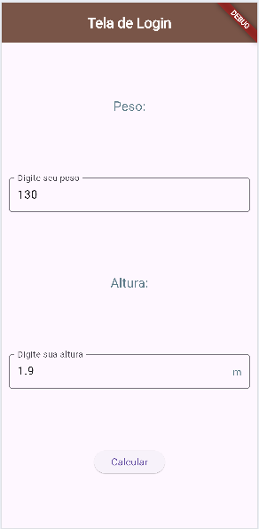|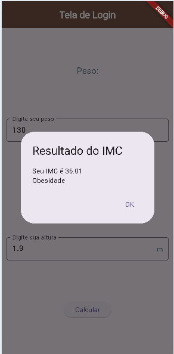|
|:-:|:-:|
|Tela Inicial|Resultado|

### Desafios
|Wireframes01|Wireframes02|Wireframes03|Desafios|
|-|-|-|-|
|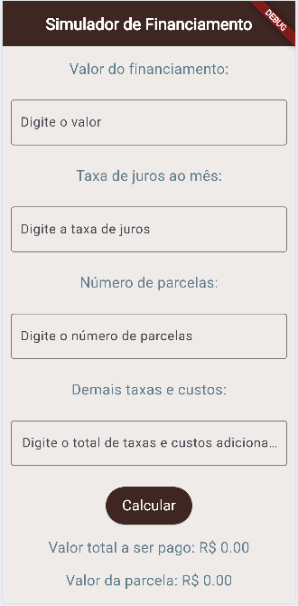|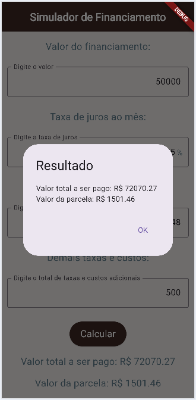|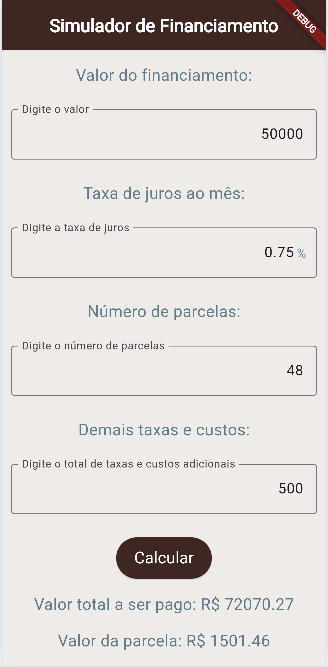|**Contextualização:** As taxas de juros continuam autíssimas dificultando a aquisição de bens e serviços. Antes de comprar um bem financiado como um carro, uma moto, um imóvel ou até mesmo um eletrodoméstico, é importante simular o valor das parcelas e o custo total do financiamento.<br>**Objetivo:** Desenvolver um aplicativo semelhante ao da imagem ao lado que recebe como entrada o valor do bem, o número de parcelas, a taxa de juros mensal e as taxas adicionais e exibe o valor da parcela e o Montante total do financiamento.|
|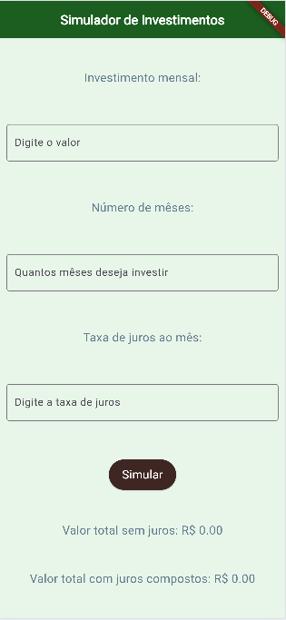|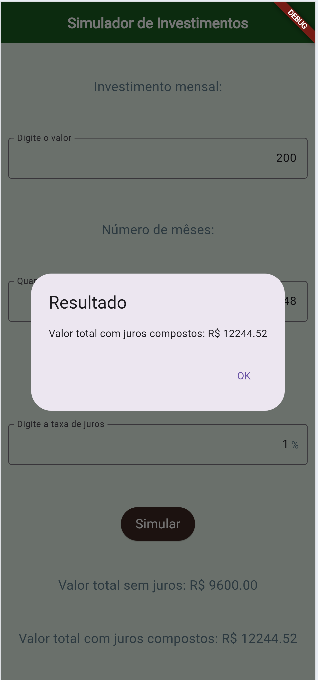|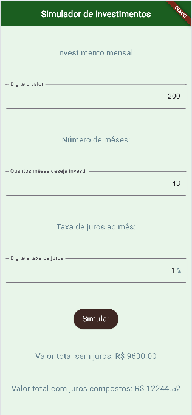|**Contextualização:** Uma alternativa ao financiamento é a paciência, quando a aquisição de um bem não é de necessidade básica ou essencial. Neste caso, é possível investir o dinheiro e esperar o tempo necessário para adquirir o bem à vista.<br>**Objetivo:** Desenvolver um aplicativo semelhante ao da imagem ao lado que recebe como entrada o valor mensal que podemos investir o número de meses e a taxa de juros mensal e exibe o montante acumulado sem juros e com juros compostos.|
|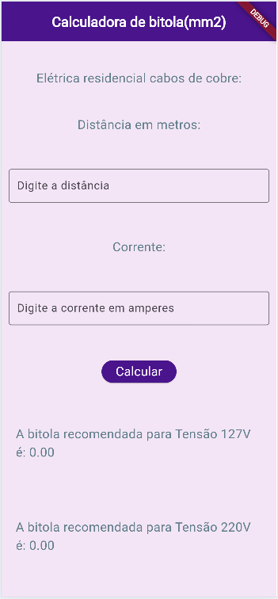|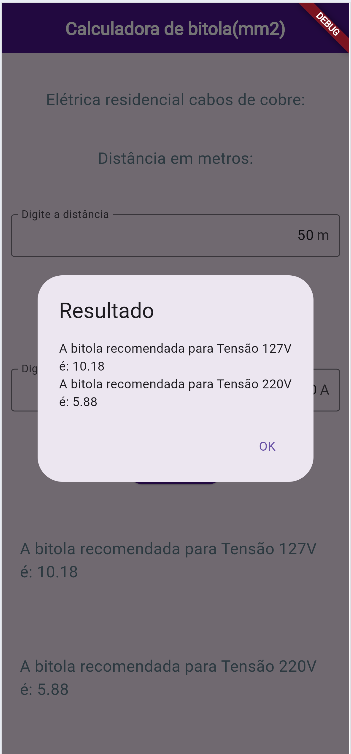|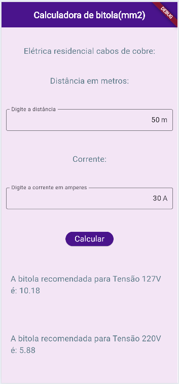|**Contextualização:** O professor de instalações elétricas ensina seus alunos como calcular a bitola adequada para cada uso de uma instalação. Solicitou que os alunos de Desenvolvimento de sistemas criem um aplicativo que faça este cálculo.<br>**Objetivo:** Desenvolver um aplicativo semelhante ao da imagem ao lado que recebe como entrada a corrente elétrica em ampères e a distância em metros e exibe a bitola do fio em milímetros quadrados, tanto para tensão de 110V quanto para 220V.<br>**Fórmula:**<br>bitola110 = (2 * corrente * distância) / 294.64<br>bitola220 = (2 * corrente * distância) / 510.4|

Faça os exercícios utilizando o Flutter, na IDE **Android Studio** ou **VsCode** ou **IDX**

## Entregas
- Cada projeto deve estar em um **repositório público separado no GitHub**.
- Nomes sugeridos para os repositórios:
  - AvaliacaoIMC
  - Financiamento
  - Investimento
  - Bitola
- Os links dos repositórios devem ser enviados para o professor neste **[Form](https://docs.google.com/forms/d/e/1FAIpQLSfecuPYLQUHw7nvPGgWiebO4NxHX8g2xLbk5-KY2oV7PmIXlg/viewform?usp=dialog)**.
- Todos os repositórios devem ter no arquivo **README.md**
  - Descrição do projeto
  - Print das telas (salvos em uma pasta assets no projeto)
  - Tecnologias
  - Passo a passo de como executar
- **Estas entregas junto com o Design Figma da aula anterior valem como a avaliação do primeiro bimestre.**

## Critérios
|Criticidade|Capacidades Básicas e Socioemocionais|Critérios|
|-|:-:|-|
||1 Identificar as características de programação de dispositivos móveis|Design: Criou o prototipo configurando um **dispositivo** mobile especificado|
||2 Preparar o ambiente necessário ao desenvolvimento do sistema para a plataforma mobile|Configurou o abiente flutter, Android Studio no computador Local e/ou criou projeto remoto|
||3 Interpretar os requisitos do sistema, tendo em vista a elaboração dos componentes em ambiente mobile|Implementou os componentes visuais conforme especificado|
||4 Definir os elementos de entrada, processamento e saída para a codificação das funcionalidades mobile|Implementou os requisitos de design ou funcionais conforme descrito|
||5 Projetar interfaces para dispositivos móveis|Criou o protótipo funcional, Implementou as funcionalidades conforme wireframes|
||6. Implementar o código respeitando as características da linguagem na plataforma mobile|Implementou na linguagem **Dart** em ambiente local ou remoto|
||1 Demonstrar autogestão|Utilizou IA apenas como apoio tentando entender a solução, contou com ajuda de colegas ou ajudou com objetivo de melhorar o aprendizado|
||2 Demonstrar pensamento analítico|Compreende como o Wireframes, Protótipos e Ambientes de desenvolvimento Mobile se relacionam, Compreende o fluxo de dados entre API, App e Locais|
||3 Demonstrar inteligência emocional|Se dedicou ao aprendizado para compreender o mínimo do componente|
||4 Demonstrar autonomia|Questionou os intrutores ou colegas sobre dúvidas ou problemas ocorridos durante o desenvolvimento. Se propôs a resolver os problemas|
