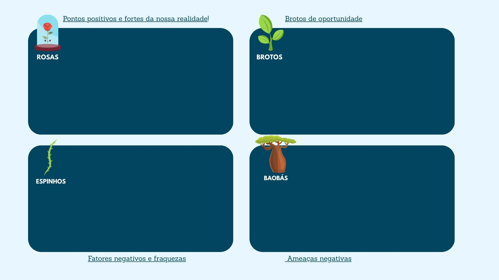

# Aula08

## Análise de viabilidade SWOT (FOFA)
A análise de viabilidade mensura os riscos de um projeto, uma boa ferramenta para esta análise é através da matriz SWOT

- Forças (Strengths)
- Fraquezas (Weaknesses)
- Oportunidades (Opportunities)
- Ameaças (Threats)

||
|:-:|
|Em analogia com "O Pequeno Príncipe" onde ele tinha como sua maior motivação a **rosa**, seus **espinhos** como ameaça, os **brotos** como oportunidades e os **baobás** como ameaças já que é uma árvore muito grande que podia devorar o planeta inteiro, faça a análise do seu projeto|

## Triângulo de Ferro

||
|:-:|
|Preencher o triângulo com o **Escopo, Custo e Prazo** detalhando em especial o escopo do seu projeto|

## Escopo da 3º Sprint
### Apresentação em 18/06

- [ ] Iniciar a codificação/desenvolvimento **Banco de dados**
- [ ] Iniciar a codificação/desenvolvimento **Back-end**
- [ ] UML [DC (Diagrama de Classes)](https://github.com/wellifabio/senai2024/tree/main/ds/3des/03-rms/aula03) **Back-End**
- [ ] Iniciar a codificação/desenvolvimento **Front-end**
- [ ] UML [DA (Diagrama de Atividades)](../../02-pbe2/aula10/README.md) **Front-End**
- [ ] Iniciar a codificação/desenvolvimento **Mobile**
- [ ] Análise de Viabilidade com Matriz SWOT
- [ ] Triângulo da qualidade do Projeto (Escopo, Prazo e Custo)
- [ ] Protótipo (Wireframe) do Front-end e Mobile

#### Obs: Todas as entregas devem estar no repositório do grupo que foi criado na sprint 01 e ser apresentado aos professores na data 25/06
Todas as pendências da sprint 02 devem ser entregues até o dia 25/06, não serão aceitas pendências após esta data.

## Checklist sas entregas
### Grupo01
- Metodologia: SCRUM
- Tema inicial: Diagnostico Rápido (Saúde relação entre paciente e médico)
- Alunos: Melissa|PO|, Lizzie|Full Stack|, Pedro|Scrum Master|, Rodrigo|Back End - QA|
- [Repositório github](https://github.com/PedroDNRusso/TCC-DS.git)
- [ ] Iniciar a codificação/desenvolvimento **Banco de dados**
- [ ] Iniciar a codificação/desenvolvimento **Back-end**
- [ ] UML [DC (Diagrama de Classes)](https://github.com/wellifabio/senai2024/tree/main/ds/3des/03-rms/aula03) **Back-End**
- [ ] Iniciar a codificação/desenvolvimento **Front-end**
- [ ] UML [DA (Diagrama de Atividades)](../../02-pbe2/aula10/README.md) **Front-End**
- [ ] Iniciar a codificação/desenvolvimento **Mobile**
- [ ] Análise de Viabilidade com Matriz SWOT
- [ ] Triângulo da qualidade do Projeto (Escopo, Prazo e Custo)
- [ ] Protótipo (Wireframe) do Front-end e Mobile

### Grupo02
- Metodologia: KANBAN - Trello
- Tema inicial: PetShop - Adoção
- Alunos: Rebeca|Front-End|, Evelyn|Banco de dados|, Larissa|Testes|, Larissa V.|Back-End|, Crislaine|Documentação|
- [Repositório github](https://github.com/rebecalazarini/tcc.git)
- [ ] Iniciar a codificação/desenvolvimento **Banco de dados**
- [ ] Iniciar a codificação/desenvolvimento **Back-end**
- [ ] UML [DC (Diagrama de Classes)](https://github.com/wellifabio/senai2024/tree/main/ds/3des/03-rms/aula03) **Back-End**
- [ ] Iniciar a codificação/desenvolvimento **Front-end**
- [ ] UML [DA (Diagrama de Atividades)](../../02-pbe2/aula10/README.md) **Front-End**
- [ ] Iniciar a codificação/desenvolvimento **Mobile**
- [ ] Análise de Viabilidade com Matriz SWOT
- [ ] Triângulo da qualidade do Projeto (Escopo, Prazo e Custo)
- [ ] Protótipo (Wireframe) do Front-end e Mobile

### Grupo03
- Metodologia: KANBAN - Trello
- Tema inicial: Paladar Nobre - Gestão de Padaria
- Alunos: Pedro|Front-End|, João|Back-End|, Steffany|Teste|, Thamye|Front-end Teste|, Rebega Ap.|PO|
- [Repositório github](https://github.com/steffanygiovanna/Projeto-padaria-2025.git)
- [ ] Iniciar a codificação/desenvolvimento **Banco de dados**
- [ ] Iniciar a codificação/desenvolvimento **Back-end**
- [ ] UML [DC (Diagrama de Classes)](https://github.com/wellifabio/senai2024/tree/main/ds/3des/03-rms/aula03) **Back-End**
- [ ] Iniciar a codificação/desenvolvimento **Front-end**
- [ ] UML [DA (Diagrama de Atividades)](../../02-pbe2/aula10/README.md) **Front-End**
- [ ] Iniciar a codificação/desenvolvimento **Mobile**
- [ ] Análise de Viabilidade com Matriz SWOT
- [ ] Triângulo da qualidade do Projeto (Escopo, Prazo e Custo)
- [ ] Protótipo (Wireframe) do Front-end e Mobile

### Grupo04
- Metodologia: SCRUM
- Tema inicial: All Wear - Provador Online (Combinações de peças com seu prórpio guarda roupas)
- Alunos: Laís|Dev - Design|, Catarina|QA - Design|, Kathleen|Dev - Design|, Beatriz|QA - Design, PO|
- [Repositório github](https://github.com/MirandaKathleen/projeto---tcc.git)
- [ ] Iniciar a codificação/desenvolvimento **Banco de dados**
- [ ] Iniciar a codificação/desenvolvimento **Back-end**
- [ ] UML [DC (Diagrama de Classes)](https://github.com/wellifabio/senai2024/tree/main/ds/3des/03-rms/aula03) **Back-End**
- [ ] Iniciar a codificação/desenvolvimento **Front-end**
- [ ] UML [DA (Diagrama de Atividades)](../../02-pbe2/aula10/README.md) **Front-End**
- [ ] Iniciar a codificação/desenvolvimento **Mobile**
- [ ] Análise de Viabilidade com Matriz SWOT
- [ ] Triângulo da qualidade do Projeto (Escopo, Prazo e Custo)
- [ ] Protótipo (Wireframe) do Front-end e Mobile

### Grupo05
- Metodologia: KANBAN
- Tema inicial: PetShop 4 patas - Sistema de Gestão de PetShop
- Alunos: Erick|Back-end|, Thiago|Front-end|, Justo|Testes|
- [Repositório github](https://github.com/ErickAguiar06/Petshop-Projeto-TCC.git)
- [ ] Iniciar a codificação/desenvolvimento **Banco de dados**
- [ ] Iniciar a codificação/desenvolvimento **Back-end**
- [ ] UML [DC (Diagrama de Classes)](https://github.com/wellifabio/senai2024/tree/main/ds/3des/03-rms/aula03) **Back-End**
- [ ] Iniciar a codificação/desenvolvimento **Front-end**
- [ ] UML [DA (Diagrama de Atividades)](../../02-pbe2/aula10/README.md) **Front-End**
- [ ] Iniciar a codificação/desenvolvimento **Mobile**
- [ ] Análise de Viabilidade com Matriz SWOT
- [ ] Triângulo da qualidade do Projeto (Escopo, Prazo e Custo)
- [ ] Protótipo (Wireframe) do Front-end e Mobile

### Grupo06
- Metodologia: SCRUM
- Tema inicial: Pizzaria do seu Zé - Pedidos Online
- Alunos: Fernando|QA|, Kamili|Scrum Master|, Willian|Back-End|, Maria|Front-end, PO|
- [Repositório github](https://github.com/Malu100/pizzaria.git)
- [ ] Iniciar a codificação/desenvolvimento **Banco de dados**
- [ ] Iniciar a codificação/desenvolvimento **Back-end**
- [ ] UML [DC (Diagrama de Classes)](https://github.com/wellifabio/senai2024/tree/main/ds/3des/03-rms/aula03) **Back-End**
- [ ] Iniciar a codificação/desenvolvimento **Front-end**
- [ ] UML [DA (Diagrama de Atividades)](../../02-pbe2/aula10/README.md) **Front-End**
- [ ] Iniciar a codificação/desenvolvimento **Mobile**
- [ ] Análise de Viabilidade com Matriz SWOT
- [ ] Triângulo da qualidade do Projeto (Escopo, Prazo e Custo)
- [ ] Protótipo (Wireframe) do Front-end e Mobile

### Grupo07
- Metodologia: KANBAN
- Tema inicial: Catálogo de Filmes
- Alunos: Jessé|Dev - Front, Testes|, Diego|Dev, Back-End, Docs|, Vitor|Dev - Front, Testes|, Arthur|Dev - Front, Testes|
- [Repositório github]()
- [ ] Iniciar a codificação/desenvolvimento **Banco de dados**
- [ ] Iniciar a codificação/desenvolvimento **Back-end**
- [ ] UML [DC (Diagrama de Classes)](https://github.com/wellifabio/senai2024/tree/main/ds/3des/03-rms/aula03) **Back-End**
- [ ] Iniciar a codificação/desenvolvimento **Front-end**
- [ ] UML [DA (Diagrama de Atividades)](../../02-pbe2/aula10/README.md) **Front-End**
- [ ] Iniciar a codificação/desenvolvimento **Mobile**
- [ ] Análise de Viabilidade com Matriz SWOT
- [ ] Triângulo da qualidade do Projeto (Escopo, Prazo e Custo)
- [ ] Protótipo (Wireframe) do Front-end e Mobile

### Grupo08
- Metodologia: Kanban
- Tema inicial: Hangetsu Uzumaki (Espiral da meia lua) - Artes Marciais
- Alunos: Hélio|Back/Teste|, João Santos|Front|, Luiza|Back/Banco|, Rhayssa|Front|
- [Repositório github](https://github.com/helio000/projeto-2025.git)
- [ ] Iniciar a codificação/desenvolvimento **Banco de dados**
- [ ] Iniciar a codificação/desenvolvimento **Back-end**
- [ ] UML [DC (Diagrama de Classes)](https://github.com/wellifabio/senai2024/tree/main/ds/3des/03-rms/aula03) **Back-End**
- [ ] Iniciar a codificação/desenvolvimento **Front-end**
- [ ] UML [DA (Diagrama de Atividades)](../../02-pbe2/aula10/README.md) **Front-End**
- [ ] Iniciar a codificação/desenvolvimento **Mobile**
- [ ] Análise de Viabilidade com Matriz SWOT
- [ ] Triângulo da qualidade do Projeto (Escopo, Prazo e Custo)
- [ ] Protótipo (Wireframe) do Front-end e Mobile

## Critérios de avaliação
|Criticidade|Capacidades Básicas e Socioemocionais|Critérios|
|-|:-:|-|
||1 Definir a sequência das atividades para desenvolvimento dos componentes, de acordo com os requisitos do sistema|Seguiu o cronograma conforme as atividades estabelwecidas entre os componentes da equipe|
||2 Definir a infraestrutura física a ser utilizada no desenvolvimento dos componentes|Estabeleceu os objetivos do projeto e temática de acordo com os recursos disponíveis na escola[Internet, computadores e conhecimentos adquiridos]|
||3 Projetar os componentes do sistema considerando as plataformas computacionais|Desenvolveu Protótipos funcionais, definiu problemas e soluções que envolvem as stacks estudadas (BD, Back, Front e Mobile)|
||4 Definir os recursos humanos e materiais para o desenvolvimento dos componentes|Escolheu a metodologia e aplicou os conceitos, designando os papéis e responsabilidades coerentemente, evidenciando no **cronograma**.|
||7 Definir os softwares a serem utilizados no desenvolvimento do sistema|Iniciou a codificação das stacks, back-end, front-end e/ou mobile|
||9 Elaborar documentação técnica do sistema|Criou os diagramas UML, Classes e Atividades|
||1 Demonstrar autogestão|Cumpriu as metas executando as atividades estabelecidas, cooperando para o sucesso do grupo|
||2 Demonstrar pensamento analítico|Compreende como os elementos do sistema se relacionam, como a solução é aplicada para resolver o problema proposto|
||3 Demonstrar inteligência emocional|Se dedicou ao aprendizado para compreender o mínimo sobre as tarefas designadas e cumprí-las|
||4 Demonstrar autonomia|Questionou os intrutores ou colegas sobre dúvidas ou problemas ocorridos durante o desenvolvimento. Se propôs a resolver os problemas|