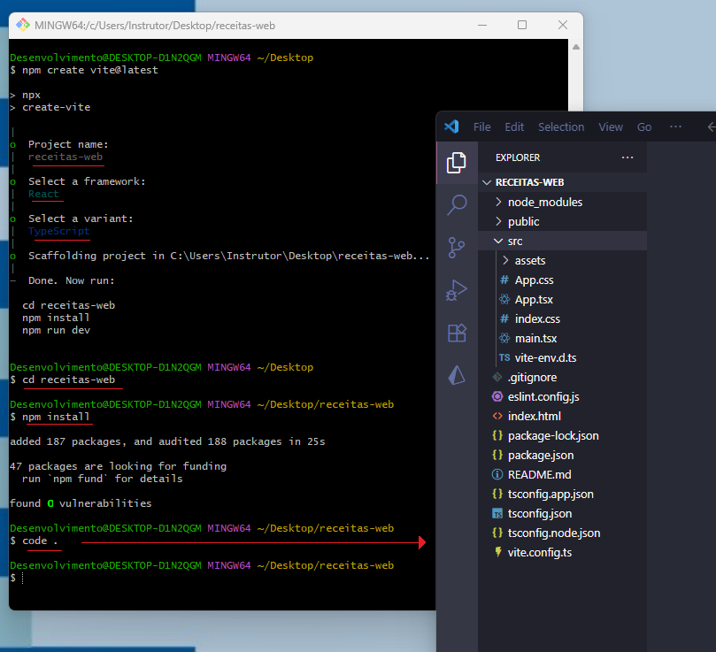
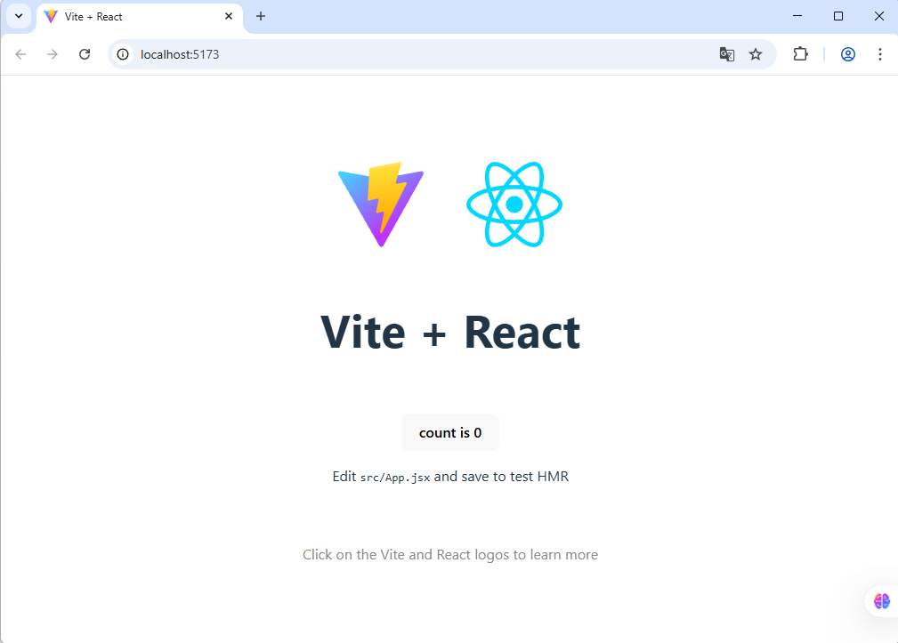
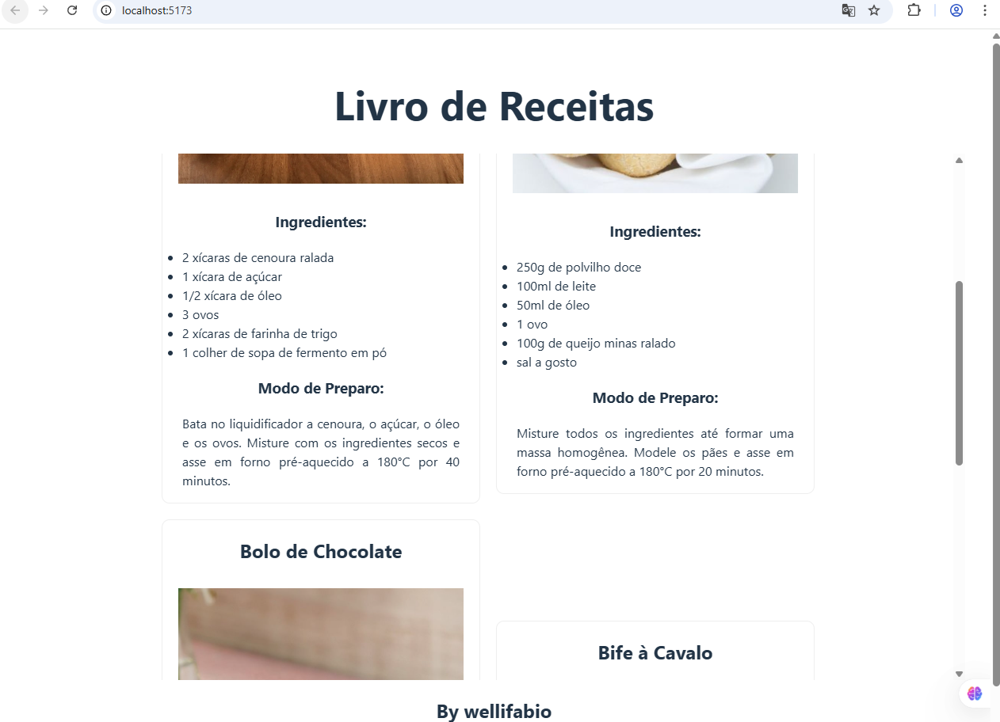

# Aula04 -  Vite / React

O **Vite** é uma ferramenta de construção rápida e leve para projetos **front-end**. Ele é especialmente útil para projetos React devido à sua configuração simples e desempenho otimizado.

#### [Projeto exemplo: Catálogo de Plantas, Exemplo Full-Stack](https://github.com/wellifabio/catalogo-full-node-vite-2025.git)

## Demonstração - Livro de Receitas com React e Vite
- Nesta aula, vamos configurar um projeto React usando Vite e criar uma aplicação simples de livro de receitas que permite aos usuários ver em forma de cards as receitas disponíveis no arquivo `receitas.json` com os dados a seguir:

```json
{
  "receitas": [
    {
      "id": 1,
      "titulo": "Bolo de Cenoura",
      "ingredientes": [
        "2 xícaras de cenoura ralada",
        "1 xícara de açúcar",
        "1/2 xícara de óleo",
        "3 ovos",
        "2 xícaras de farinha de trigo",
        "1 colher de sopa de fermento em pó"
      ],
      "modoPreparo": "Bata no liquidificador a cenoura, o açúcar, o óleo e os ovos. Misture com os ingredientes secos e asse em forno pré-aquecido a 180°C por 40 minutos.",
      "imagem": "https://cozinha365.com.br/wp-content/uploads/2025/02/Bolo-de-cenoura-S.webp"
    },
    {
      "id": 2,
      "titulo": "Pão de Queijo",
      "ingredientes": [
        "250g de polvilho doce",
        "100ml de leite",
        "50ml de óleo",
        "1 ovo",
        "100g de queijo minas ralado",
        "sal a gosto"
      ],
      "modoPreparo": "Misture todos os ingredientes até formar uma massa homogênea. Modele os pães e asse em forno pré-aquecido a 180°C por 20 minutos.",
      "imagem": "https://www.receitas-sem-fronteiras.com/media/hehe-3_crop.jpg/rh/pao-de-queijo-3-ingredientes.jpg"
    },
    {
      "id": 3,
      "titulo": "Bolo de Chocolate",
      "ingredientes": [
        "2 xícaras de açúcar",
        "1 xícara de manteiga",
        "4 ovos",
        "2 xícaras de farinha de trigo",
        "1 xícara de chocolate em pó",
        "1 colher de sopa de fermento em pó"
      ],
      "modoPreparo": "Bata o açúcar com a manteiga até obter um creme. Adicione os ovos, um a um, e misture bem. Incorpore os ingredientes secos e asse em forno pré-aquecido a 180°C por 50 minutos.",
      "imagem": "https://recipesblob.oetker.com.br/assets/a81bc035eb7f407faaa2c93e04edaf78/750x910/bolo-de-aniversrio-de-chocolate.jpg"
    },
    {
      "id": 4,
      "titulo": "Bife à Cavalo",
      "ingredientes": [
        "4 bifes de alcatra ou contra filé",
        "4 ovos",
        "sal e pimenta a gosto",
        "óleo para fritar"
      ],
      "modoPreparo": "Tempere os bifes com sal e pimenta. Frite os bifes em uma frigideira com óleo quente. Em outra frigideira, frite os ovos. Sirva os bifes com os ovos por cima.",
      "imagem": "https://www.comidaereceitas.com.br/wp-content/uploads/2011/03/bife_cavalo.jpg"
    }
  ]
}
```

## Iniciando o novo projeto WEB receitas com Vite
Em sua área de trabalho abra o git bash ou terminal e execute os seguinte comando:
```bash
npm create vite@latest 
```
- Será solicitado o nome do projeto, digite `receitas-web` e pressione `Enter`.
- Em seguida, selecione a opção `React` usando as setas do teclado e pressione `Enter`.
- Depois, selecione a opção `TypeScript` e pressione `Enter`.
- A ferramenta Vite criará a estrutura inicial do projeto. Navegue até a pasta do projeto:
```bash
cd receitas-web
npm install
code .
```
Pode aparecer alguma confirmação, pressione `y` para confirmar:

### Estrutura de Pastas
Será criada uma estrutura de pastas semelhante a esta:
<br>
- Para executar o projeto modelo base que foi criado basta segurar o CTRL e clicar no link que aparece no terminal.
```bash
 ➜  Local:   http://localhost:5173/
```


### Codificando a Home Page
Vamos codificar a home pagem para listar em forma de **cards** cada receita do arquivo `receitas.json`, antes crie uma pasta chamada **mockups** dentro da pasta **public** do seu projeto e adicione o arquivo `public/mockups/receitas.json` com o conteúdo exibido no **início** desta aula:
- Agora vamos criar o componente principal da aplicação, a página `src/App.tsx` com o conteúdo a seguir:

```jsx
import './App.css'
import {useState, useEffect} from 'react'
import axios from 'axios'

function App() {

  const url = './receitas.json'
  const [receitas, setReceitas] = useState([])

  function obterDados() {
    axios.get(url).then((response) => {
      setReceitas(response.data.receitas)
    })
  }

  useEffect(() => {
    obterDados()
  }, [])

  return (
    <>
      <header>
        <h1>Livro de Receitas</h1>
      </header>
      <main>
        {receitas.map((receita: any, index) => (
          <div key={index} className="card">
            <h2>{receita.titulo}</h2>
            
            <h3>Ingredientes:</h3>
            <ul>
              {receita.ingredientes.map((ingrediente: string, idx: number) => (
                <li key={idx}>{ingrediente}</li>
              ))}
            </ul>
            <h3>Modo de Preparo:</h3>
            <p>{receita.modoPreparo}</p>
          </div>
        ))}
      </main>
      <footer>
        <h2>By wellifabio</h2>
      </footer>
    </>
  )
}

export default App
```
- Vamos codificar as duas páginas de estilo, a `index.css` e a `App.css`, para deixar nossa aplicação mais organizada. A primeira normalmente contém estilos globais, enquanto a segunda é específica para os componentes da aplicação.
- `src/App.css`
```css
#root {
  max-width: 1280px;
  margin: 0 auto;
  padding: 2rem;
  text-align: center;
}

.logo {
  height: 6em;
  padding: 1.5em;
  will-change: filter;
  transition: filter 300ms;
}
.logo:hover {
  filter: drop-shadow(0 0 2em #646cffaa);
}
.logo.react:hover {
  filter: drop-shadow(0 0 2em #61dafbaa);
}

@keyframes logo-spin {
  from {
    transform: rotate(0deg);
  }
  to {
    transform: rotate(360deg);
  }
}

@media (prefers-reduced-motion: no-preference) {
  a:nth-of-type(2) .logo {
    animation: logo-spin infinite 20s linear;
  }
}

main{
  max-height: 75vh;
  width: 100%;
  display: flex;
  flex-wrap: wrap;
  justify-content: center;
  align-items: center;
  gap: 20px;
  overflow-y: auto;
}

.card {
  width: 400px;
  max-width: 100%;
  border: 1px solid #eee;
  border-radius: 10px;
  & img{
    margin: 10px;
    max-width: 90%;
  }
  & ul, p{
    padding: 0 25px 0 25px;
    text-align: justify;
  }
}

.read-the-docs {
  color: #888;
}

```
- `index.html`
```html
<!doctype html>
<html lang="en">
  <head>
    <meta charset="UTF-8" />
    <link rel="icon" type="image/png" href="/icone.png" />
    <meta name="viewport" content="width=device-width, initial-scale=1.0" />
    <title>Livro de Receitas</title>
  </head>
  <body>
    <div id="root"></div>
    <script type="module" src="/src/main.tsx"></script>
  </body>
</html>
```
### Print dos resultados


# Desafio
## Contextualização
Como programador Front-End, você atua constantemente em atualizações de sites e aplicações web. A aplicação acima utiliza dados Mockados (simulados) para exibir as receitas. No entanto, em um cenário real, esses dados geralmente são obtidos de uma API externa.

## Desafio
A [API](https://receitasapi-b-2025.vercel.app/) possui dados de receitas semelhantes aos do arquivo `receitas.json`, com as 4 funcionalidades básicas CDUD. Sua tarefa é modificar a aplicação React para buscar os dados dessa API em vez de usar o arquivo local.
- **C**reate (Criar): Adicionar novas receitas.
- **R**ead (Ler): Exibir a lista de receitas (já implementado).
- **U**pdate (Atualizar): Editar receitas existentes.
- **D**elete (Deletar): Remover receitas.
- Utilize a biblioteca `axios` para facilitar as requisições HTTP. Você pode instalar o `axios` executando o seguinte comando no terminal dentro da pasta do projeto:
```bash
npm install axios
```
- Atualize o código para incluir as funcionalidades de criação, atualização e exclusão de receitas, além de buscar os dados da API.

