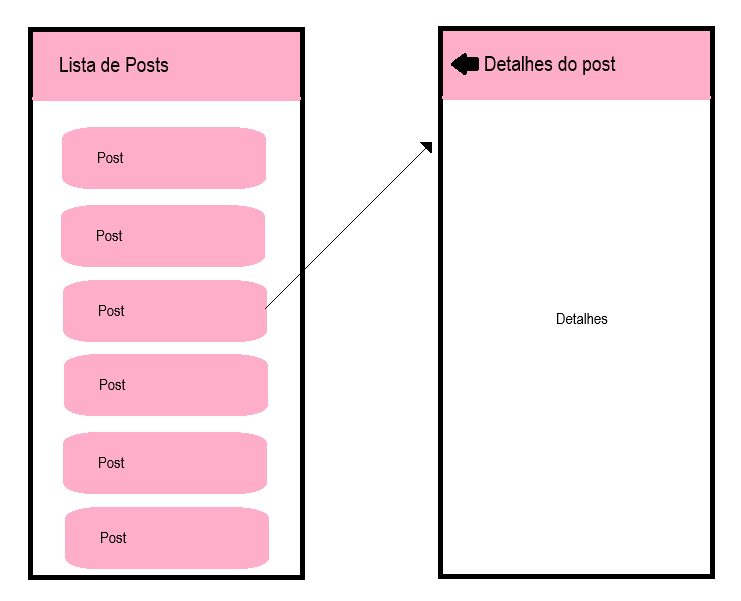

# Aula03 - Navegação entre telas - Expo-router

## Objetivos
- Importância de navegação entre telas
- Passagem de parâmetros
- Listas (FlatList)
- 
## Conteúdo
- Introdução à navegação em aplicativos móveis
    - Tipos de navegação
    - Navegação em pilha
- Navegação em abas
Implementação da navegação em um aplicativo
    - Configuração do ambiente
    - Criação de telas
    - Implementação da navegação
## Pilha de Navegação
Para começar, certifique-se de ter o Expo CLI instalado. Se ainda não o fez, você pode instalá-lo com o seguinte comando:
```bash
npm install -g expo-cli
```
Em seguida, crie um novo projeto React Native com o Expo, já na versão mais recente do Expo que possui o Expo-router integrado:
```bash
npx create-expo-app@latest listdets
cd listdets
npm run reset-project
```
### Configuração do Expo-router
Acesse a pasta ./app do seu projeto e verá dois arquivos: index.tsx e _layout.tsx. O arquivo _layout.tsx é responsável por definir a estrutura de navegação do aplicativo.

- Vamos criar um layout básico com duas telas: uma para listar itens e outra para exibir detalhes.
- Edite o arquivo `_layout.tsx` para incluir as telas de lista e detalhes:
```tsx
import { Stack } from "expo-router";
import { StyleSheet } from "react-native";

const styles = StyleSheet.create({
  faixa: {
    backgroundColor: "#806",
  },
  texto: {
    color: "#fff",
  },
});

export default function Layout() {
  return <Stack
    screenOptions={{
      headerStyle: styles.faixa,
      headerTitleStyle: styles.texto,
    }}
  >
    <Stack.Screen name="index" options={{ title: "Lista de Posts" }} />
    <Stack.Screen name="detalhes" options={{ title: "Detalhes do Post" }} />

  </Stack>;
}
```
- Para dados de exemplo e simulação, crie um arquivo assets/mockups/posts.ts com o seguinte conteúdo:
```ts
export const posts = [
  { id: 1, title: 'Post 1', content: 'Conteúdo do Post 1', image: 'https://wellifabio.github.io/assets/avts/av1.webp' },
  { id: 2, title: 'Post 2', content: 'Conteúdo do Post 2', image: 'https://wellifabio.github.io/assets/avts/av2.webp' },
  { id: 3, title: 'Post 3', content: 'Conteúdo do Post 3', image: 'https://wellifabio.github.io/assets/avts/av3.webp' },
  { id: 4, title: 'Post 4', content: 'Conteúdo do Post 4', image: 'https://wellifabio.github.io/assets/avts/av4.webp' },
  { id: 5, title: 'Post 5', content: 'Conteúdo do Post 5', image: 'https://wellifabio.github.io/assets/avts/av5.webp' },
  { id: 6, title: 'Post 6', content: 'Conteúdo do Post 6', image: 'https://wellifabio.github.io/assets/avts/av6.webp' },
  { id: 7, title: 'Post 7', content: 'Conteúdo do Post 7', image: 'https://wellifabio.github.io/assets/avts/av1.webp' },
  { id: 8, title: 'Post 8', content: 'Conteúdo do Post 8', image: 'https://wellifabio.github.io/assets/avts/av2.webp' },
  { id: 9, title: 'Post 9', content: 'Conteúdo do Post 9', image: 'https://wellifabio.github.io/assets/avts/av3.webp' },
  { id: 10, title: 'Post 10', content: 'Conteúdo do Post 10', image: 'https://wellifabio.github.io/assets/avts/av4.webp' },
  { id: 11, title: 'Post 11', content: 'Conteúdo do Post 11', image: 'https://wellifabio.github.io/assets/avts/av5.webp' },
  { id: 12, title: 'Post 12', content: 'Conteúdo do Post 12', image: 'https://wellifabio.github.io/assets/avts/av6.webp' },
];
```
- Copie o código a seguir e cole no arquivo `index.tsx`
```tsx
import { router } from "expo-router";
import { FlatList, StyleSheet, Text, TouchableOpacity, View } from "react-native";
import { posts } from "../assets/mockups/posts";

const styles = StyleSheet.create({
  container: {
    flex: 1,
    justifyContent: "center",
    alignItems: "center",
    backgroundColor: "#fce",
  },
  list: {
    width: "100%",
  },
  item: {
    flex: 1,
    flexDirection: "row",
    alignItems: "center",
    justifyContent: "space-between",
    margin: 6,
    padding: 20,
    backgroundColor: "#f9c",
    borderRadius: 8,
  },
  titulo: {
    fontWeight: "bold",
    fontSize: 20,
    color: "#836"
  },
  text: {
    fontSize: 16,
  },
});

export default function Index() {

  function irParaDetalhes(id: number) {
    router.push(`/detalhes?id=${id}`);
  }

  return (
    <View
      style={styles.container}
    >
      <FlatList
        style={styles.list}
        data={posts}
        renderItem={({ item }) => (<TouchableOpacity
          style={styles.item}
          onPress={() => irParaDetalhes(item.id)}
        >
          <Text style={styles.titulo}>Título: {item.title}</Text>
          <Text style={styles.text}>Título: {item.content}</Text>
        </TouchableOpacity>)}
      />
    </View>
  );
}
```