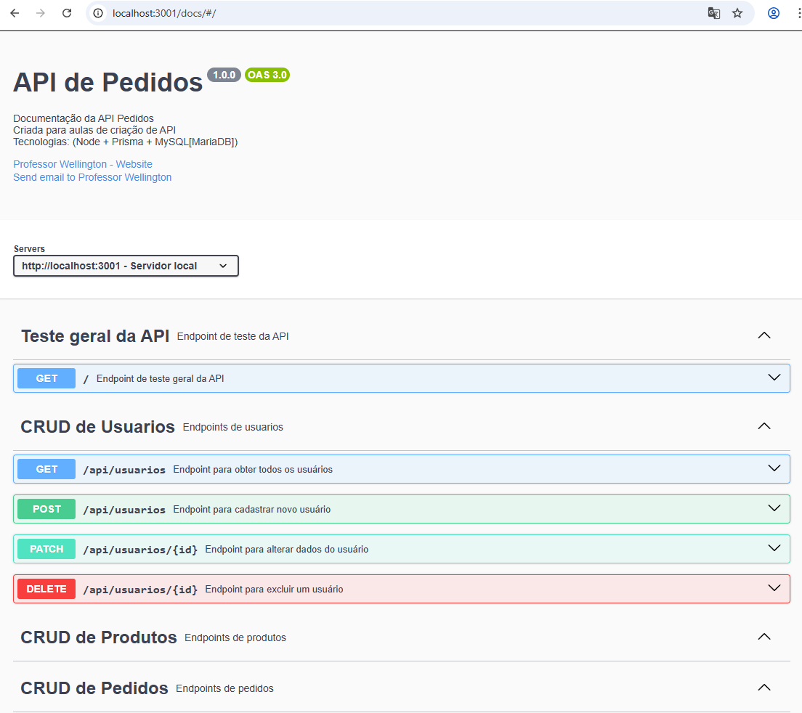

# API de Pedidos


## Requisitos funcionais
- [RF001] O sistema deve permitir o CRUD de **Usuários**.
    - [RF001.1] O campo email deve ser único.
- [RF002] O sistema deve permitir o CRUD de **Produtos**.
- [RF003] O sistema deve permitir o CRUD de **Pedidos**.
    - [RF003.1] A data deve ter valor padrão com a data e hora atual obtido do sistema.
## Requisitos não funcionais
- [RN001] Linguagem de programação **JavaScript**;
- [RN002] Framework **Node.js**;
- [RN003] SGBD **MySQL(MariaDB)**;
- [RN004] ORM **Prisma**;
- [RN005] Documentação e testes unitários e de integração com **Swagger**;

## Para testar
- 1 Clone este repositório
- 2 Abra o XAMPP e inicie o MySQL
- 3 Abra com o VsCode e em um terminal **CMD** ou **BASH** instale as dependências
```bash
npm install
```
- 4 Crie o arquivo .env na raiz do projeto contendo
```js
DATABASE_URL="mysql://root@localhost:3306/pedidosapi?schema=public&timezone=UTC"
```
- 5 Faça a migração do banco de dado som Prisma
```bash
npx prisma migrate dev --name init
```
- 6 Execute a API
```bash
npm run dev
```
- 7 Abra a documentação swagger conforme caminho no console.
<br>