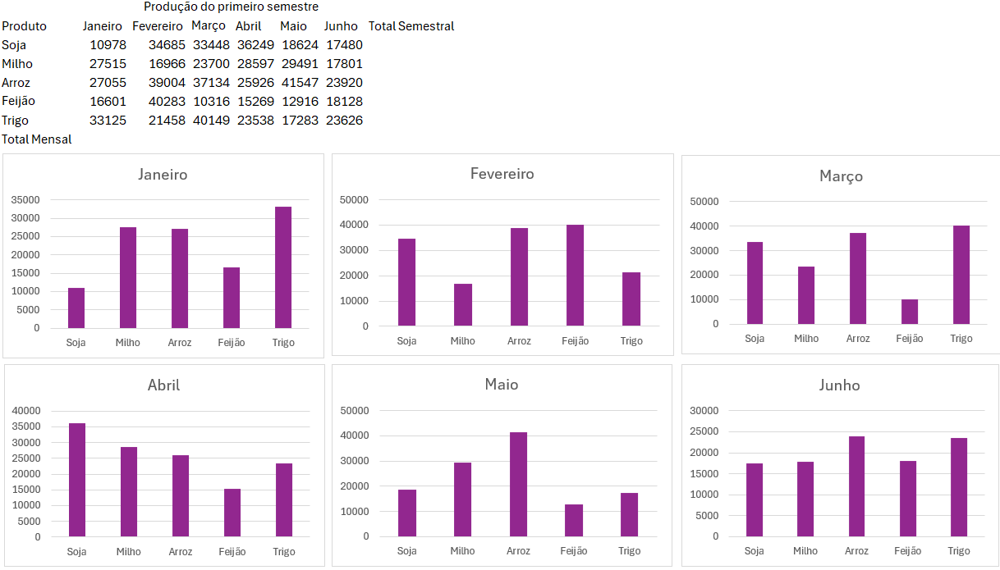
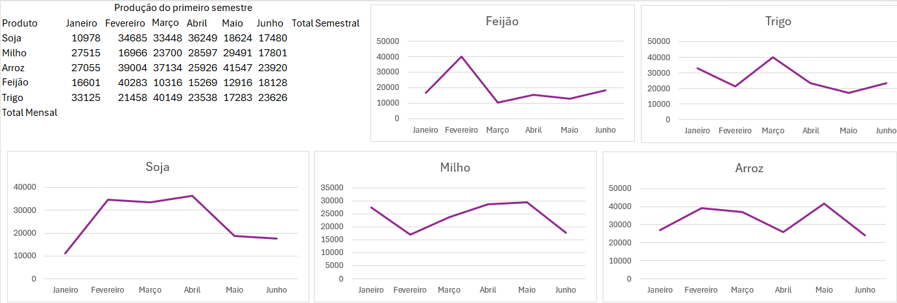
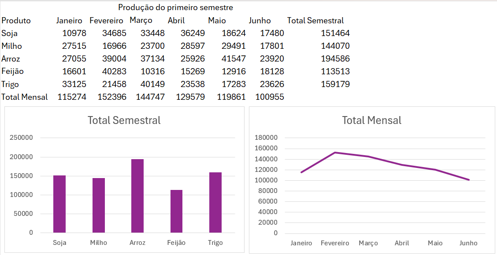
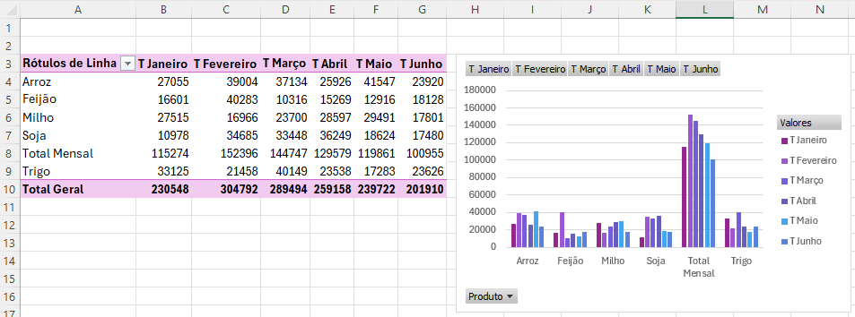
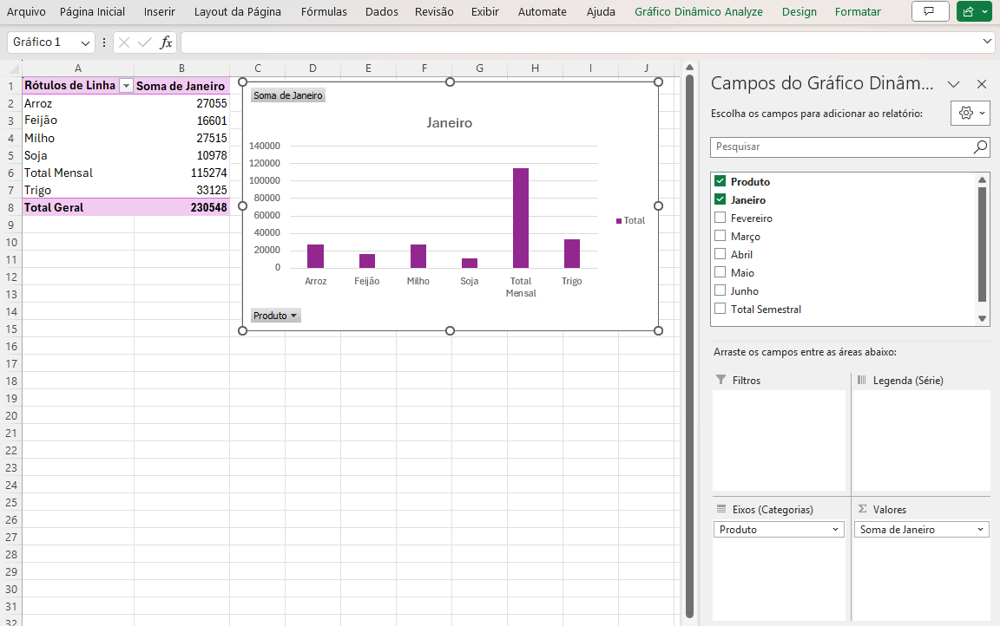
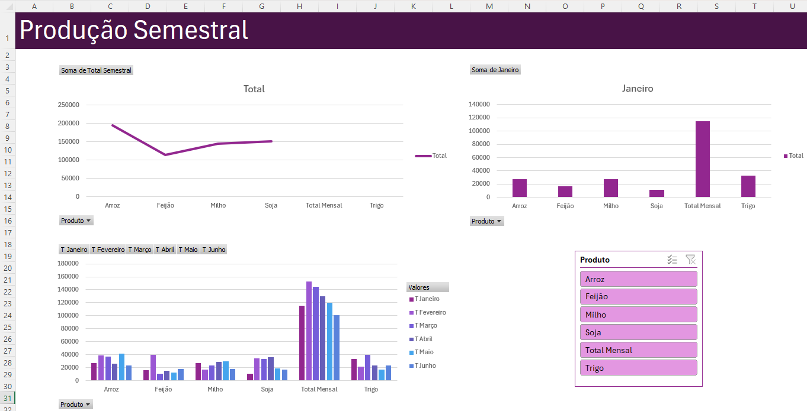

# Aula07 - Dashboard Básico
## Demonstração 01
- Produção semestral
- 

|Graficos Simples para analisar os dados de produção|
|-|
||
||
||
|Gráficos dinâmicos para montar um dashboard|
||
||
|Dashboard com seguimentação de dados|
||
## Atividade
- Digite a planilha a seguir e calcule a comissão de cada vendedor:
- 
