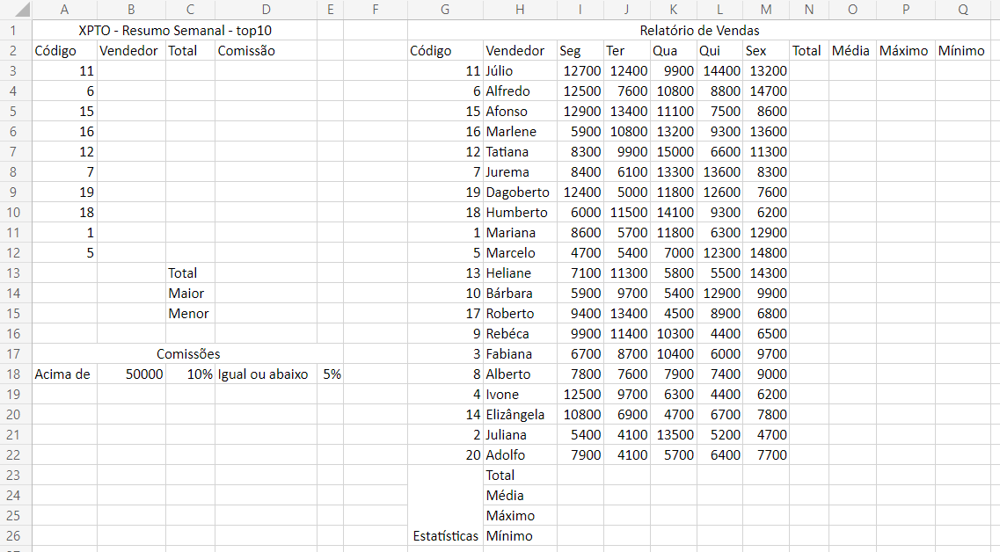
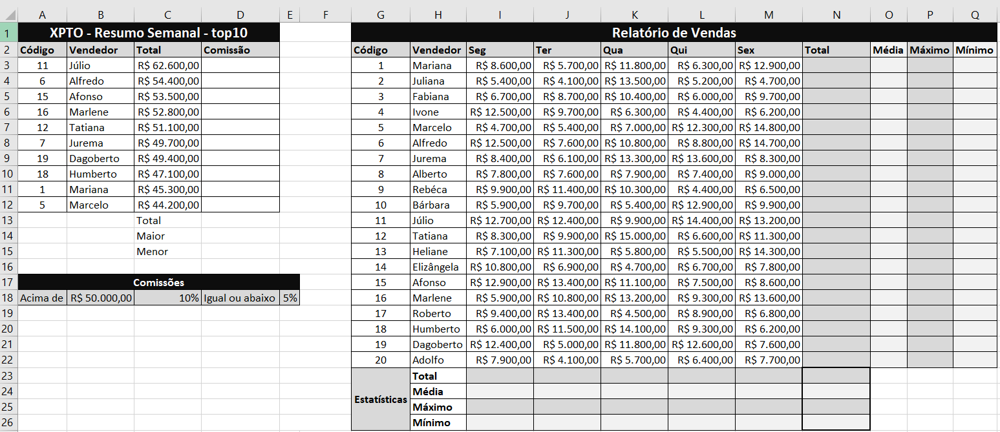

# Aula08 - Excel Básico

# VPS01 (Verificação Prática Formativa 01)

|Abra uma nova pasta de trabalho do excel e digite a planilha a seguir:|
|-|
||
|Ao concluir a digitação formate os dados, valores em reais, bordas, cores a sua escolha, e classifique os dados por código de A-Z conforme exemplo a seguir:|
||

- 1 Preencha a coluna "B" com os nomes dos vendedores:
  - Utilize a função PROCV(Código, Tabela Relatório, Coluna 2)
- 2 Preencha a coluna "C" com os totais de cada vendedor
  - Utilize a função PROCV(Código, Tabela Relatório, Coluna 8)
- 3 Na coluna "D" calcule a comissão de cada vendedor seguindo a regra das comissões descrita na linha 18, utilize a função SE().
- 4 Calcule as estatísticas por dia da semana (Total, Média, Máximo e Mínimo) somente até a coluna "M"
- 5 Calcule as estátísticas por funcionário colunas (N, O, P e Q) somente até a linha "22"
- 6 Calcule as estatísticas do Total "coluna N" (Soma(), Média(), Máximo() e Mínimo())
- 7 Selecione as colunas "B" e "D", vendedor e comissão e crie um gráfico recomendado, deixe-o ao na mesma página porém abaixo das Comissões na linha 19.
- 8 Calcule o Total, Maior e Menor comissão nas células (D13, D14, D15)
- 9 Crie um **Dashboard** com dois gráficos dinâmicos de (vendedor e total) e (vendedor e comissão) aplique **segmentação** de dados por vendedor.
- 10 Clique no link a seguir e responda o questionário: https://forms.gle/N3io1HFogznzxPh57