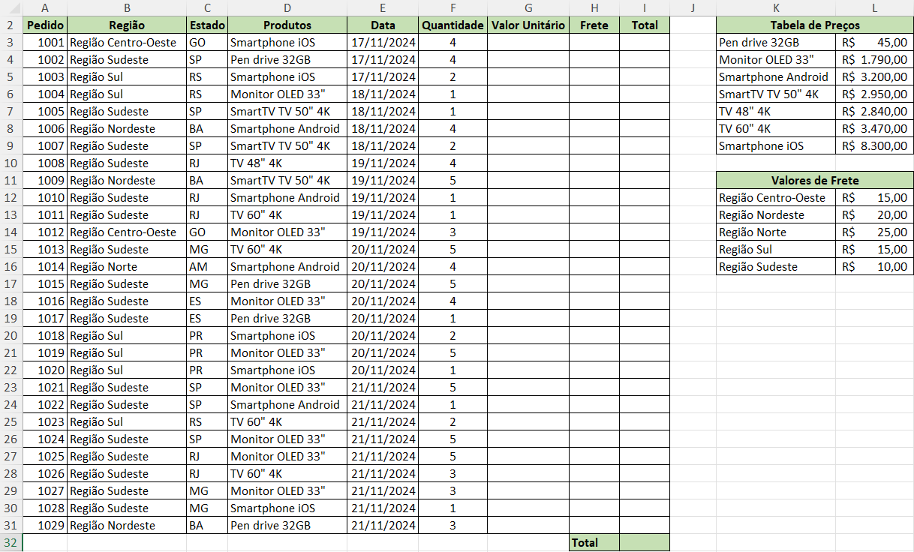
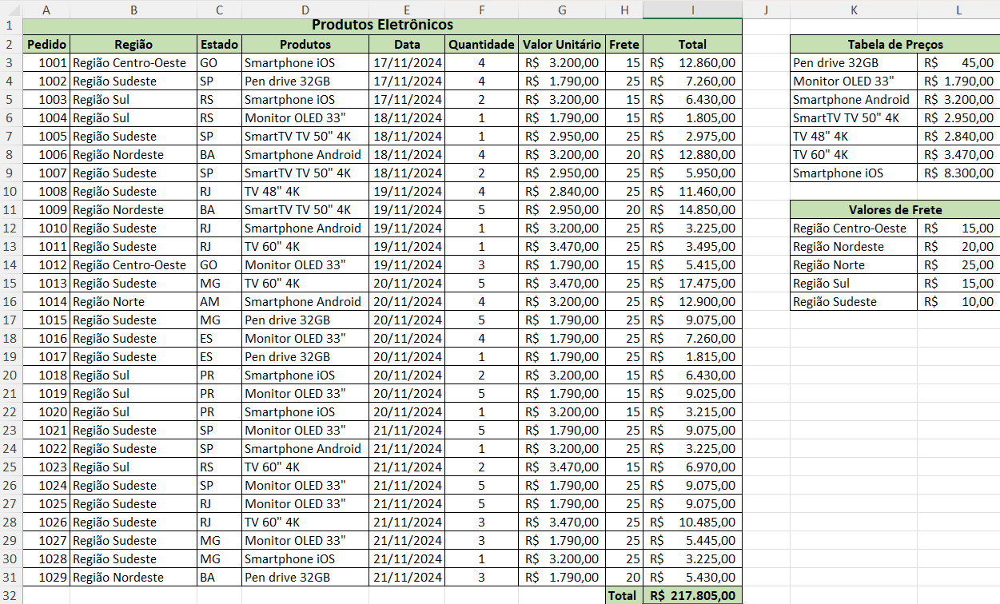
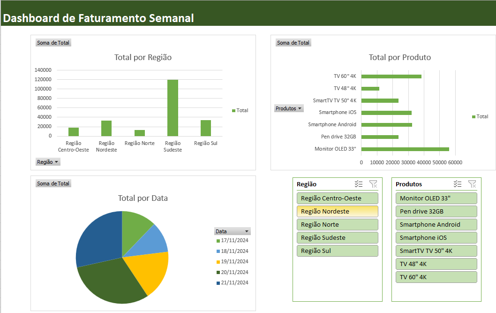

# Aula09 - Excel Básico

# VPS02 (Verificação Prática Formativa 02)

## Situação de aprendizagem:

|Planilha com cálculos de faturamento de vendas|
|-|
||

- Dados para preencher a planilha principal sem a necessidade de digitação
```
1001	Região Centro-Oeste	GO	Smartphone iOS	17/11/2024	4
1002	Região Sudeste	SP	Pen drive 32GB	17/11/2024	4
1003	Região Sul	RS	Smartphone iOS	17/11/2024	2
1004	Região Sul	RS	Monitor OLED 33"	18/11/2024	1
1005	Região Sudeste	SP	SmartTV TV 50" 4K	18/11/2024	1
1006	Região Nordeste	BA	Smartphone Android	18/11/2024	4
1007	Região Sudeste	SP	SmartTV TV 50" 4K	18/11/2024	2
1008	Região Sudeste	RJ	TV 48" 4K	19/11/2024	4
1009	Região Nordeste	BA	SmartTV TV 50" 4K	19/11/2024	5
1010	Região Sudeste	RJ	Smartphone Android	19/11/2024	1
1011	Região Sudeste	RJ	TV 60" 4K	19/11/2024	1
1012	Região Centro-Oeste	GO	Monitor OLED 33"	19/11/2024	3
1013	Região Sudeste	MG	TV 60" 4K	20/11/2024	5
1014	Região Norte	AM	Smartphone Android	20/11/2024	4
1015	Região Sudeste	MG	Pen drive 32GB	20/11/2024	5
1016	Região Sudeste	ES	Monitor OLED 33"	20/11/2024	4
1017	Região Sudeste	ES	Pen drive 32GB	20/11/2024	1
1018	Região Sul	PR	Smartphone iOS	20/11/2024	2
1019	Região Sul	PR	Monitor OLED 33"	20/11/2024	5
1020	Região Sul	PR	Smartphone iOS	20/11/2024	1
1021	Região Sudeste	SP	Monitor OLED 33"	21/11/2024	5
1022	Região Sudeste	SP	Smartphone Android	21/11/2024	1
1023	Região Sul	RS	TV 60" 4K	21/11/2024	2
1024	Região Sudeste	SP	Monitor OLED 33"	21/11/2024	5
1025	Região Sudeste	RJ	Monitor OLED 33"	21/11/2024	5
1026	Região Sudeste	RJ	TV 60" 4K	21/11/2024	3
1027	Região Sudeste	MG	Monitor OLED 33"	21/11/2024	3
1028	Região Sudeste	MG	Smartphone iOS	21/11/2024	1
1029	Região Nordeste	BA	Pen drive 32GB	21/11/2024	3
```
- Copie e cole os dados na sua planilha do Excel.

## Desafios
- 1 Utilizando a função **PROCV()** preencha a coluna **G "Valor unitário"** buscando os dados na **tabela** ao lado
- 2 Também utilizando a função **PROCV()** preencha a coluna **H "Frete"** buscando os dados na **tabela** ao lado.
- 3 Calcule o total na coluna **I "Total", o frete é por produto, verifique a quantidade de cada produto e some ao frete.
- 4 Calcule o "Total" geral na célula **I32**

|Planilha com os valores calculados para conferência|
|-|
||

- 5 Crie um dashboard com pelo menos 3 gráficos (Região, produto e Data), aplique **segmentação de dados** por **Região** e **Produto**.

|Exemplo de como o dashboard deve se parecer|
|-|
||
