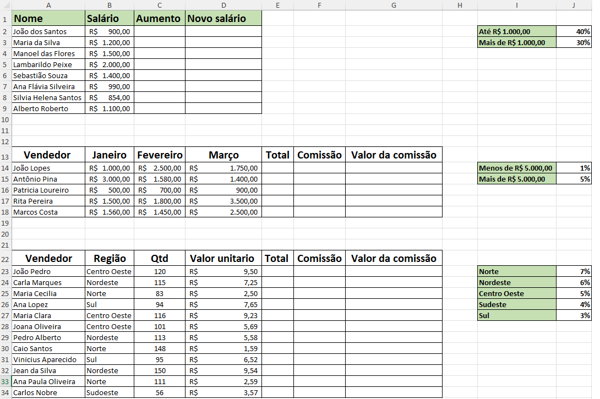

# Aula10 - Excel Básico

# VPS03 (Verificação Prática Formativa 03)

## Situação de aprendizagem:

|Planilha com cálculos de reajustes salariais e comissões|
|-|
||

## Desafios
- 1 Utilizando a funão SE() obtenha o aumento salarial seguindo o critério acima ou abaixo de 1000
- 2 Calcule o Novo salário aplicando a porcentagem de reajuste.
- 3 Na segunda planilha calcule o total simplismente somando os valores dos três meses (Janeiro, Fevereiro e Março)
- 4 Obtenha a comissão utilizando a função SE() conforme critério de mais ou menos de 5000
- 5 Calcule o valor da comissão
- 6 Na terceira planilha calcule o total.
- 7 Obtenha a porcentagem de comissão utilizando procv() pela região
- 8 Calcule o valor da comissão
- 9 Crie um dashboard da terceira planilha com pelo menos dois gráficos seguimentando vendedor e região