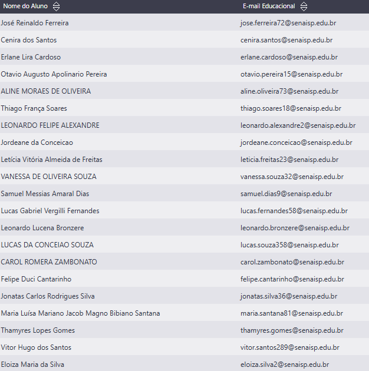
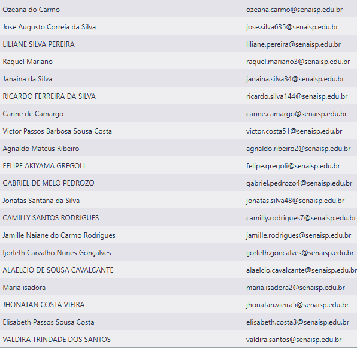

# Aula01
## Sistema Operacional Windows
## Hardware x Software
## Periféricos
    - Como utilizar mouse
    - Como utilizar teclado
        - Principais teclas, Tab, Shitf, CTRL, Alt ...
    - Edição de textos simples com Bloco de notas
## Navegação e criação
    - Pastas
    - Arquivos

## Emails educacionais

