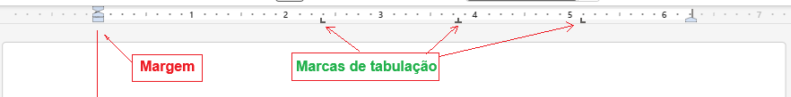
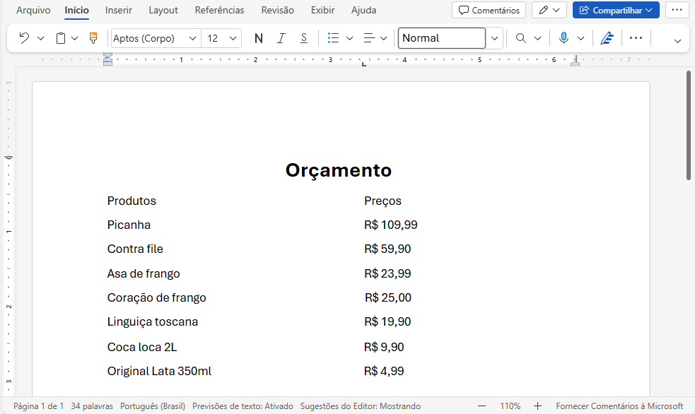
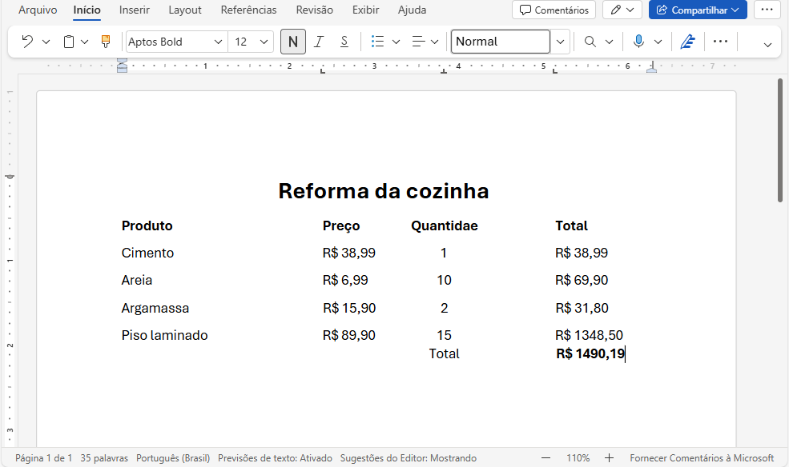
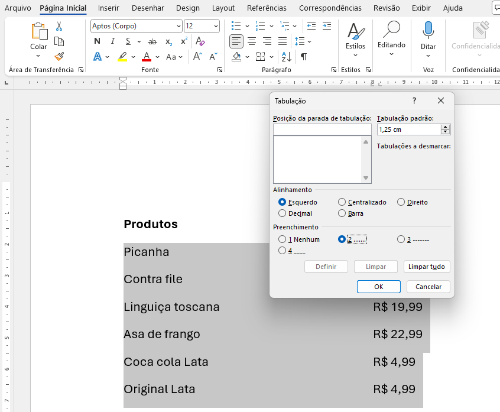
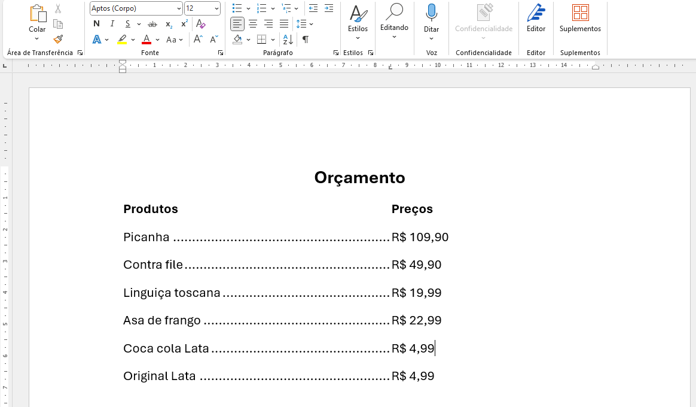
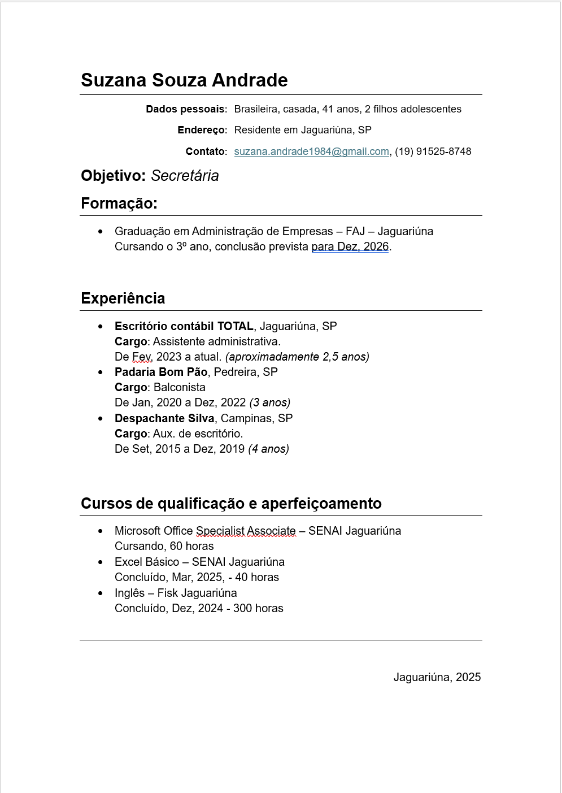
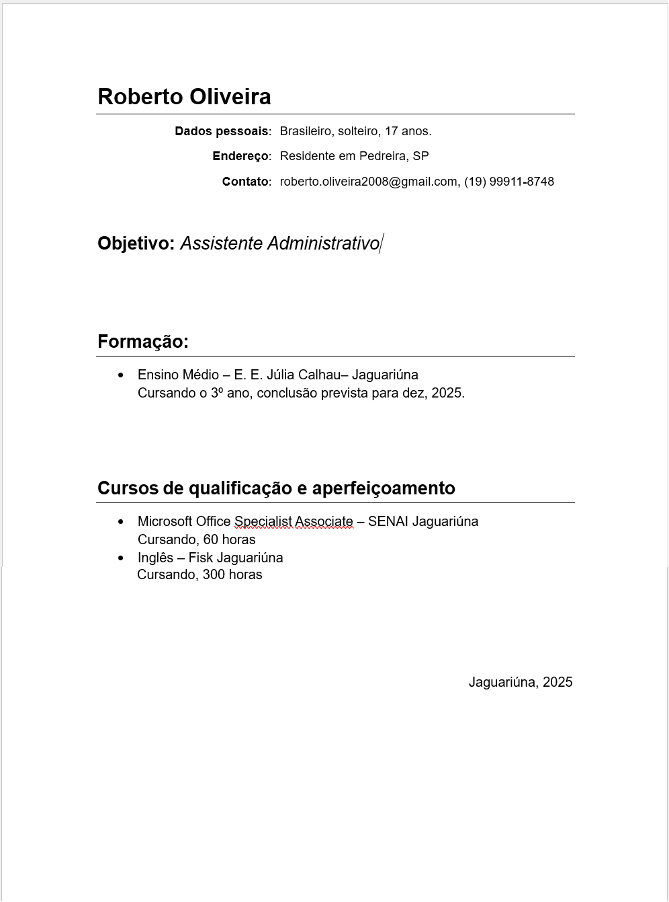
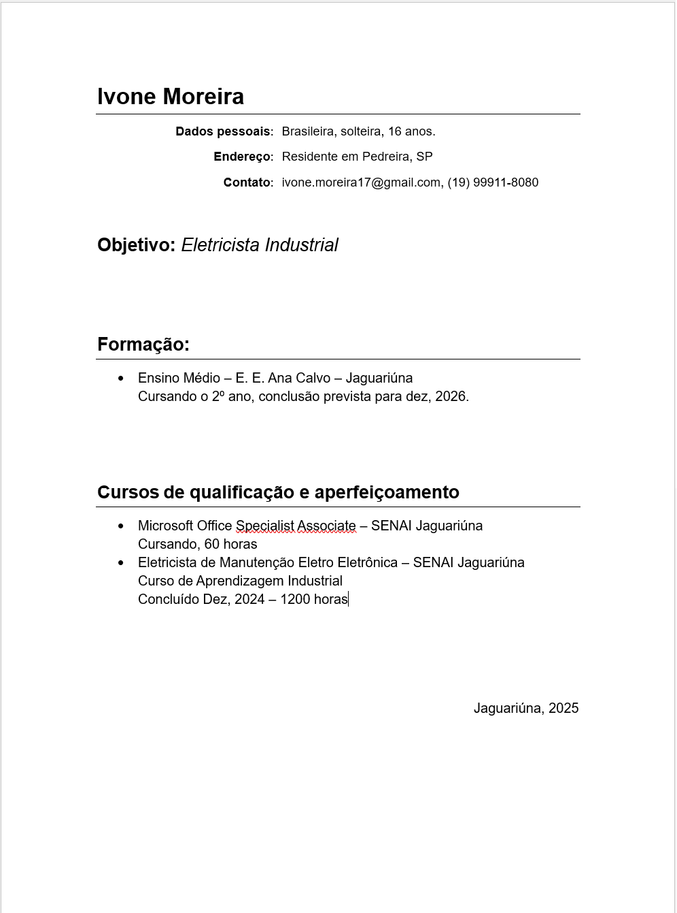

# Aula03 - Word

## Tabulação
Para colocar ou retirar marcas de tabulação precizamos **Exibir** a **Régua**

Ao iniciar uma **lista** ou qualquer texto que seja organizado em colunas ou tabelas, podemos utilizar as **marcas de tabulação**.

### Demonstração 01
- 1 Vamos digitar o orçamento a seguir, colocando uma marca de tabulação e utilizando a tecla **TAB**.
 
- 2 Podemos fechar sem salvar e fazer o **segundo exemplo**:
 
- Formate centralizando o título e colocando o cabeçalho em negrito.

## Desafio
Refaça o primeiro orçamento porém agora colocando **pontilhado** entre os produtos e valores
- 
- O resultado deve ficar semelhante a este:
- 

## Currículo
Vamos fazer um currículo simples, utilizando formatação, tabulação e listas.
- A seguir temos três exemplos de currículos de pessoas com ides e experiências diferentes:
- Exemplo 01

- Exemplo 02

- Exemplo 03

## Atividade
Com base nos exemplos acima, construa o seu currículo utilizando o Word Online.