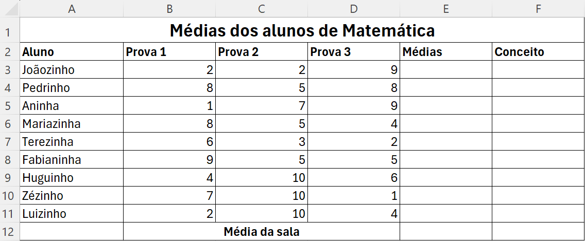

# Aula 02 Excel

## Atividade Revisão.

Na aula 01 de excel, aprendemos a formatar células, inserir dados, elaborar fórmulas e trabalhar com algumas funções.
Nesse início de aula iremos revisar o conteúdo da aula anterior, realizando uma breve atividade.

- Abra o excel e copie os dados da imagem acima.
- Para cada linha, calcule o "Total do Mês" que representa a soma de todos os gastos.
- Ao final da coluna "Total do Mês" existe o campo "Total" que irá representar a soma dos gastos de todos os meses.
- O campo "Orçamento" deve ser preenchido com valor a sua escolha.
- O campo "Saldo" será a diferença entre o total das despesas e o orçamento.

 

## Atividade Relatório Escola.

Novas funções: MÁXIMO, MÍNIMO e MÉDIA.
Novos Recursos: Formatação Condicional.

- Copie os dados da imagem para uma planilha do excel.
- Utilizando as funções aprendidas calcule as médias dos alunos.
- Caso a média seja maior do que 6 formate a cécula com Verde, caso contrário com Vermelho.
- Baseado na média calculada preencha a coluna "Conceito" com "Aprovado" ou "Reprovado".
- Calcule a média da sala.
- Baseado nos resultados levante a maior e a menor média da sala.   