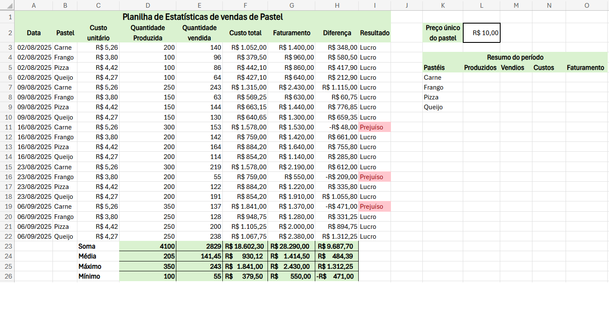

# Aula04
Continuando no tema da barraca de pastel, nesta aula vamos aprender a calcular as estatísticas das vendas e verificar se houve lucro ou prejuízo.
 - Para isso digite a planilha a seguir que mostra as vendas de cada sabor de pastel nas feiras aos sábados.
 
 - Calcule o **Custo total** de cada sabor de pastel.
 - Calcule o **Faturamento**.
 - Calcule a **Diferença** entre o faturamento e o custo total.
 - Utilize a função **SE()** para verificar se houve lucro ou prejuízo.

|Função SE()|Descrição|
|-|-|
|=SE(teste_lógico; valor_se_verdadeiro; valor_se_falso)|Realiza um teste lógico e retorna um valor se o teste for verdadeiro e outro valor se o teste for falso.|
|=SE(H3>0; "Lucro"; "Prejuíso")|Verifica se o valor na célula H3 é maior que 0. Se for, retorna "Lucro"; caso contrário, retorna "Prejuízo".|

 - Por fim calcule a (Soma, Média, Máximo e Mínimo) das Quantidades, Custos, Faturamentos e Diferenças.
 
 
 - Utilize a função **SOMASE()** para calcular o total produzido, vendido, custos e faturamento de cada sabor de pastel.

|Função SOMASE()|Descrição|
|-|-|
|=SOMASE(intervalo; critérios; [intervalo_soma])|Soma os valores em um intervalo que atendem a critérios específicos.|
|=SOMASE(B3:B22; "Carne"; C3:C22)|Soma os valores na coluna C (C3:C22) onde os valores correspondentes na coluna A (A3:A22) são iguais a "Carne".|