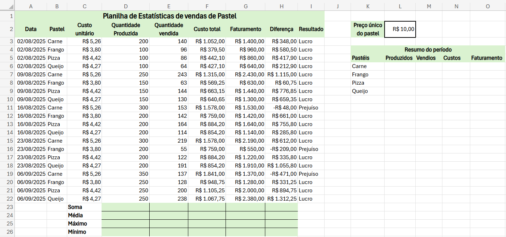

# Aula04
Continuando no tema da barraca de pastel, nesta aula vamos aprender a calcular as estatísticas das vendas e verificar se houve lucro ou prejuízo.
 - Para isso digite a planilha a seguir que mostra as vendas de cada sabor de pastel nas feiras aos sábados.
 
 - Calcule o **Custo total** de cada sabor de pastel.
 - Calcule o **Faturamento**.
 - Calcule a **Diferença** entre o faturamento e o custo total.
 - Utilize a função **SE()** para verificar se houve lucro ou prejuízo.
 - Por fim calcule a (Soma, Média, Máximo e Mínimo) das Quantidades, Custos, Faturamentos e Diferenças.
 - Utilize a função **SOMASE()** para calcular o total produzido, vendido, custos e faturamento de cada sabor de pastel.