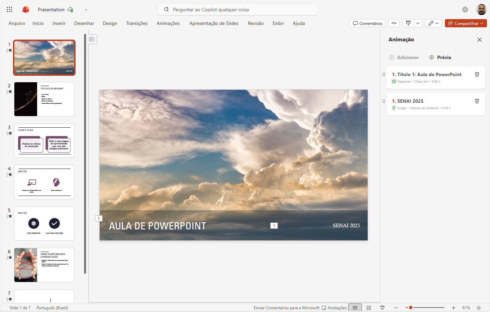
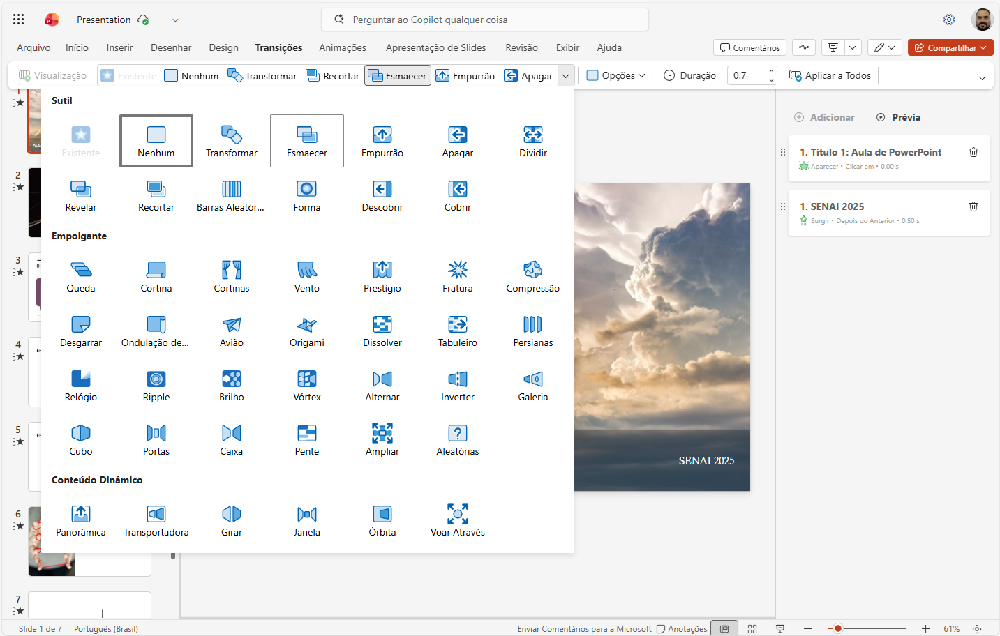
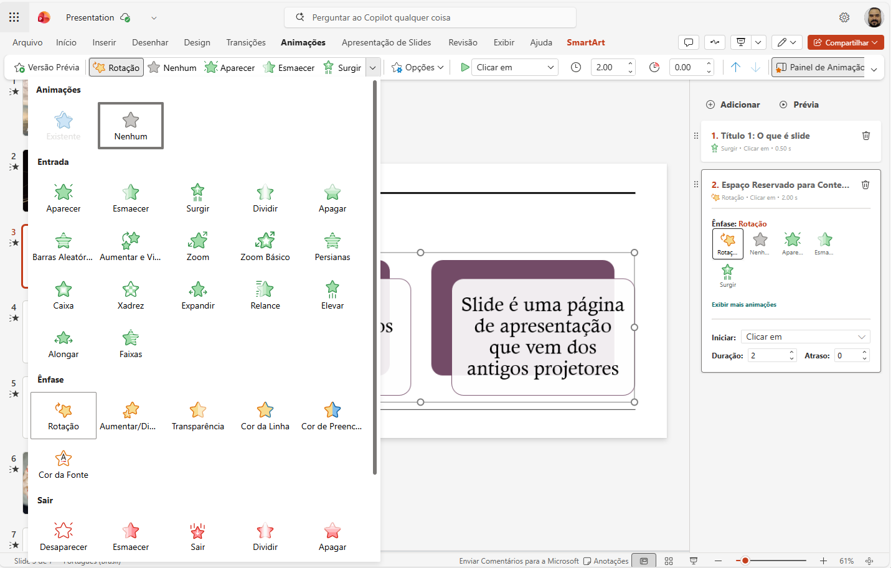

# Aula01 - PowerPoint

## PowerPoint
Editor de apresentações profissionais

## Acessar via Web
- 1 acessar o outlook.com
- 2 Entrar com email @ senaisp.edu.br e senha
- 3 Clicar em no ícone  e escolhe **PowerPoint**
 
- 4 Criar uma apresentação em branco

## Criando uma apresentação
- 1 Clicar em Criar uma apresentação em branco
 
 Ao lado **esquerdo** podemos inserir os slides, ao **centro** editar o conteúdo e ao lado **direito**, gerenciar sugestões de layouts (A Ia Copilot sugere imagens de acordo com o conteúdo da apresentação) e opções de animações e outras configurações.
 
 Ao concluir os conteúdos, podemos aplicar **Animações** individuais nos objetos dos slides e animações na troca (**Transição de slides**) dos slides
 
- 2 Por fim apresente o slide e teste as animações e transições.