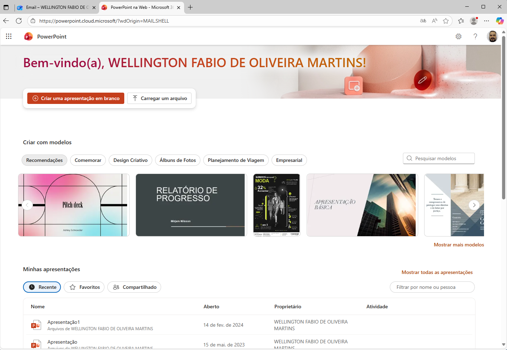

# Aula01 - PowerPoint

## PowerPoint
Editor de apresentações profissionais

## Acessar via Web
- 1 acessar o outlook.com
- 2 Entrar com email @ senaisp.edu.br e senha
- 3 Clicar em no ícone  e escolhe **PowerPoint**
 
- 4 Criar uma apresentação em branco

## Criando uma apresentação