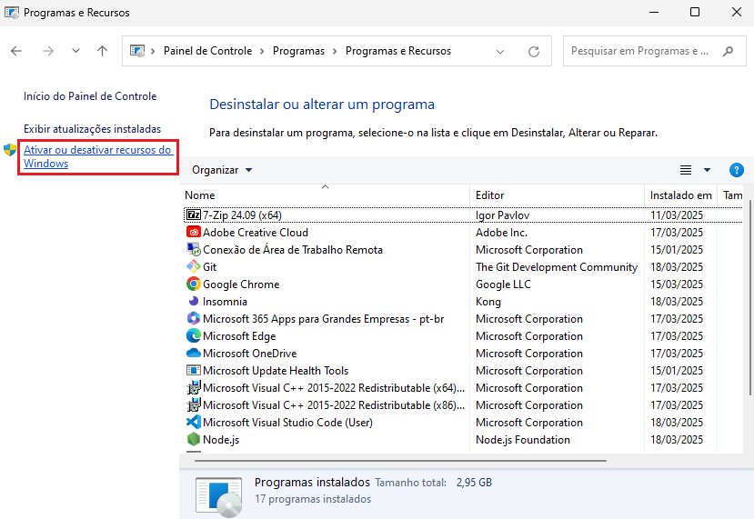
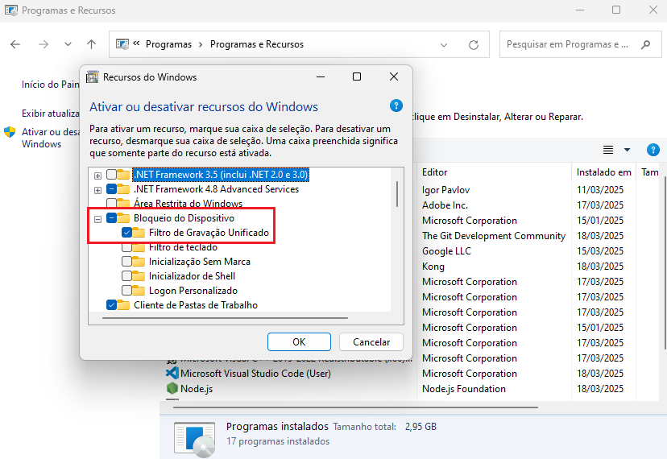

# UWF - Recurso de bloqueio e desbloqueiodo Windows
## Filtro de Gravação Unificado
- Instalar e habilitar o filtro
- 
- 

## Comandos
```cmd
uwfmgr.exe overlay set-type Disk
uwfmgr.exe overlay set-size 10000
uwfmgr filter enable
```
- Concluídos - Reiniciar PC
- Para Habilitar a proteção
```cmd
uwfmgr.exe volume protect c:
uwfmgr.exe get-config
```
- Para desabilitar a proteção
```cmd
uwfmgr.exe volume unprotect c:
uwfmgr.exe get-config
```