# Aula04
## Fontes de dados variadas e API
### Temas
- Varegistas do Sudeste (Combinar dados csv)
- Restaurante Delivery: JSON local
- Endereços a partir da API Via CEP: JSON https://viacep.com.br/ws/SP/Jaguari%C3%BAna/Bueno/json

# Atividade 01
Em seu computador crie uma pasta chamada **"sudeste"** e baixe para dentro dela os arquivos **.csv** contidos neste repositório, na subpasta **/varegistasudeste**.
- 1 Abra o **Power BI** e crie um novo projeto, importe os arquivos **csv** e **combine** os dados.
- 2 Crie dois relatórios com os dados dos arquivos conforme imagens a seguir:
  -  2.1 Uma análise gráfica do valor de venda por categoria
  -  2.2 Outra de vendedor por categoria em um gráfico de mapa de árvore
  -  2.3 E um com uma análise com mapa.
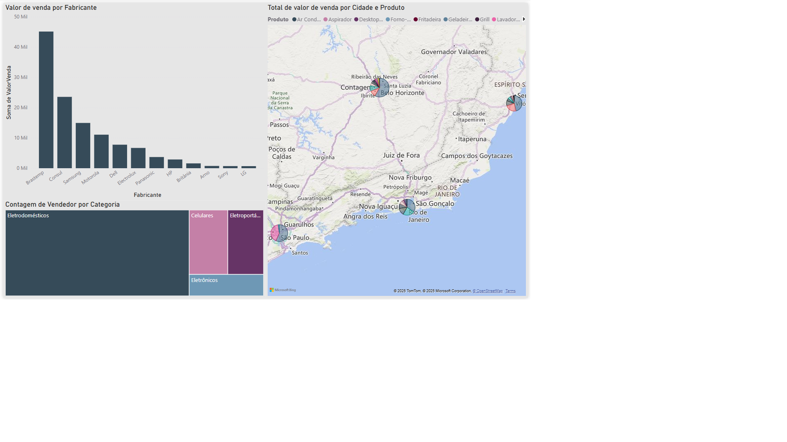
- 3 Crie outra página de dashboard analisando:
  - 3.1 Faça um gráfico de valor de venda por estado.
  - 3.2 Uma de valor de venda do primeiro segmento.
  - 3.3 Um gráfico de valor de venda por vendedor
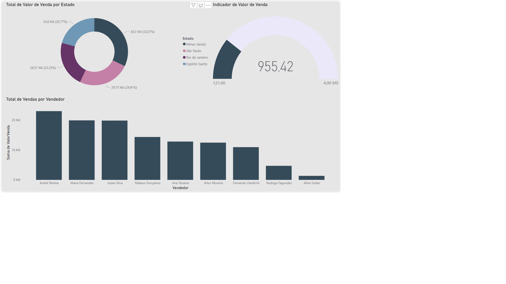

# Atividade 02
Relacionamento de dados e arquivos JSON: em outra pasta salve os dados de um restaurante, que estão no repositório **/restaurante**.
- 1 Faça download dos arquivos .json da pasta restaurante e salve na pasta que você criou localmante no computador. 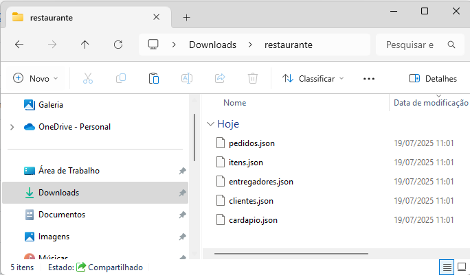
- 2 Abra o Power BI, crie um novo "Relatório em branco" e importe os dados dos arquivos 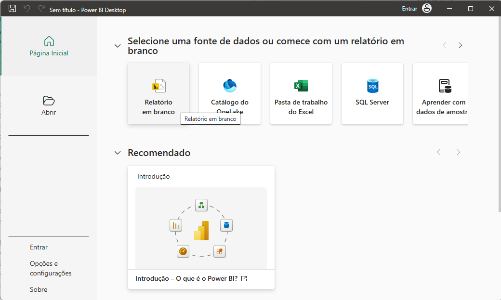 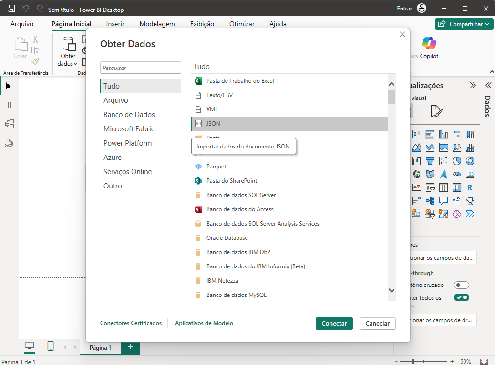 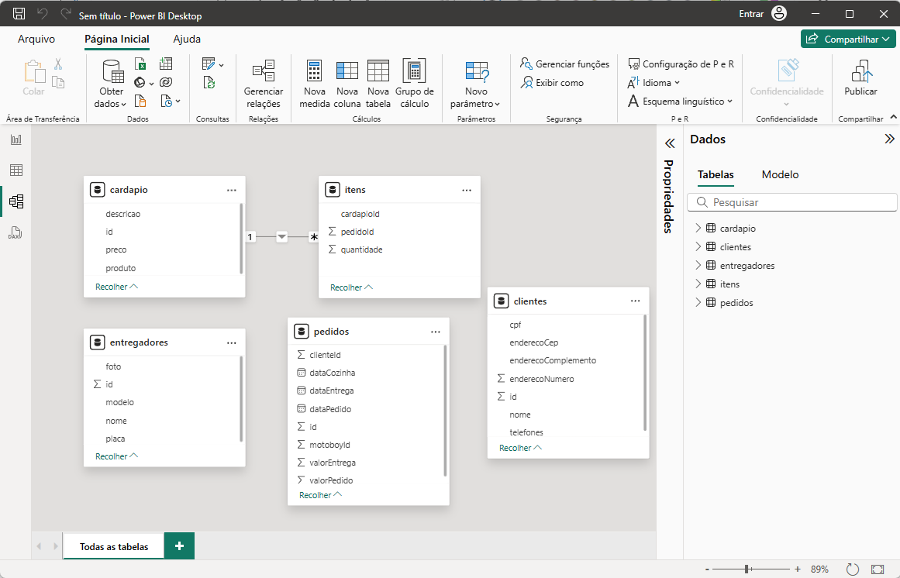
- 3 Importe os dados de endereços atualizados da **Web** a partir da **API** Via CEP no endereço: https://viacep.com.br/ws/SP/Jaguari%C3%BAna/Bueno/json 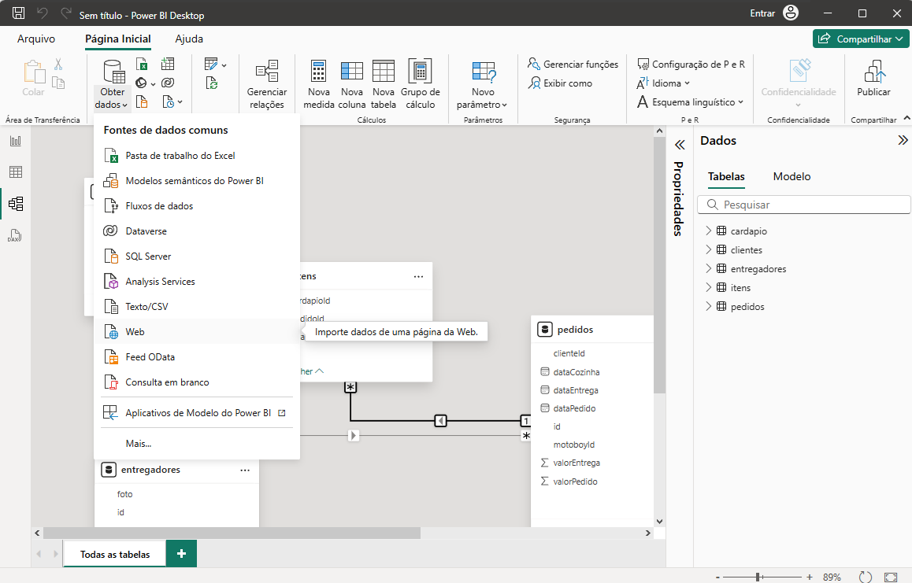 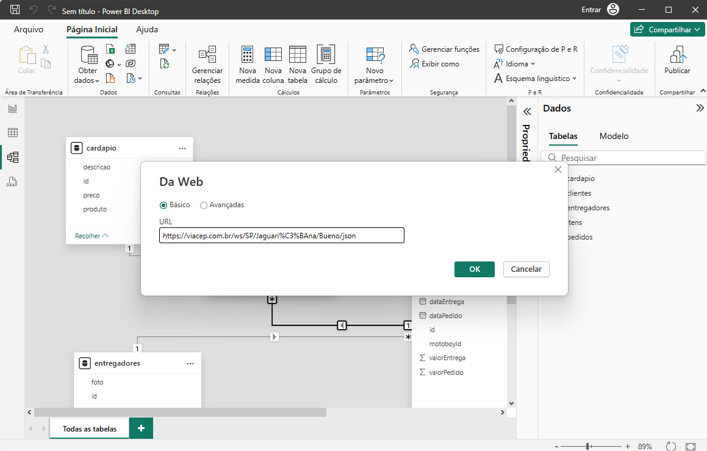
- 4 Após importar e se necessário transformar os dados. Crie os **relacionamentos** conforme imagem a seguir:
 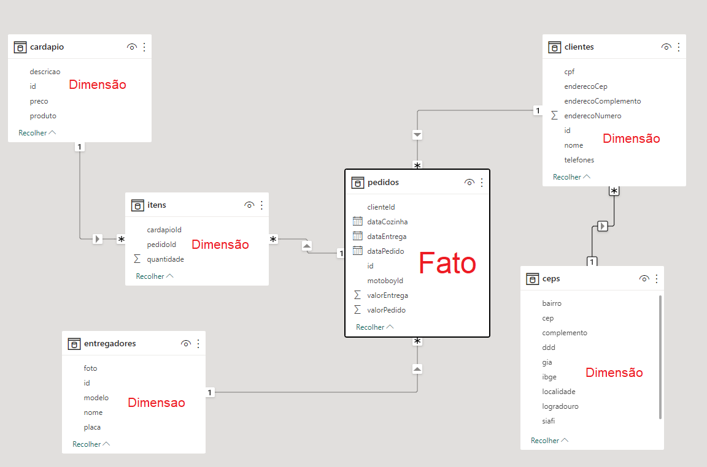
  Os relacionamentos acima representam uma análise de dados em **Estrela**, onde os dados são divididos em **Fato** e **Dimensões**
- 5 Ao concluir os relacionamentos, faça um dashboard/relatório analisando os dados para mostrar as seguintes informações.
  - A) Entregas por entregador
  - B) Fotos dos entregadores
  - C) Custo das entregas
  - D) Faturamento total do restaurante
  - E) Pedidos no local (sem entrega)
- 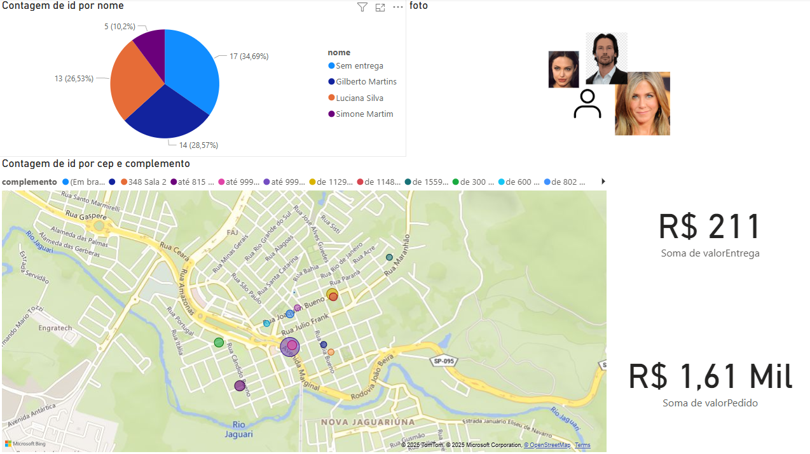
- Obs: Você vai precisar importar o visual Image Grig para mostrar a foto do entregador:
- 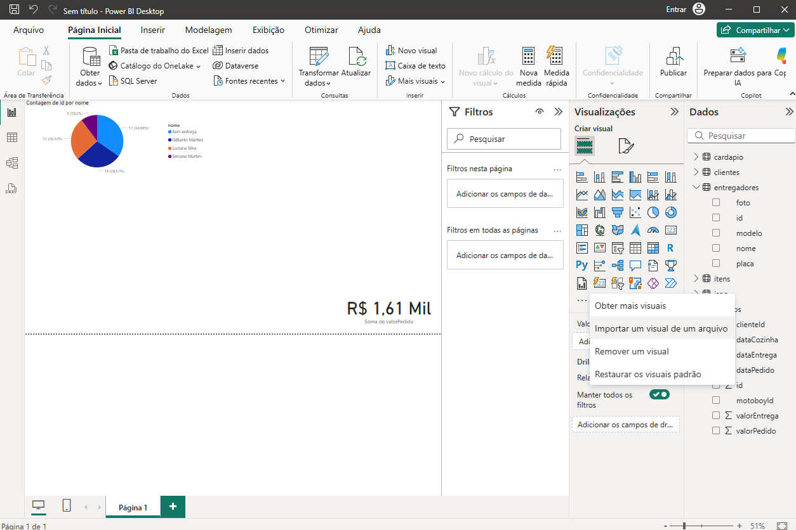
